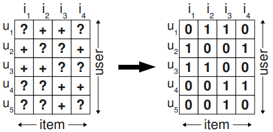
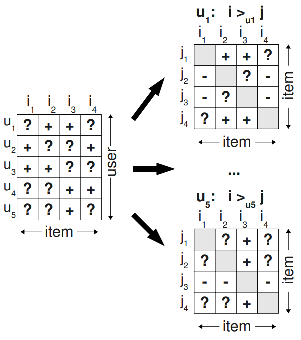
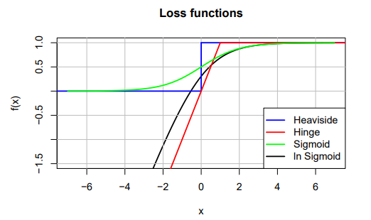
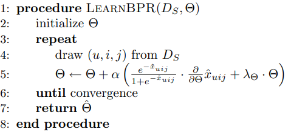
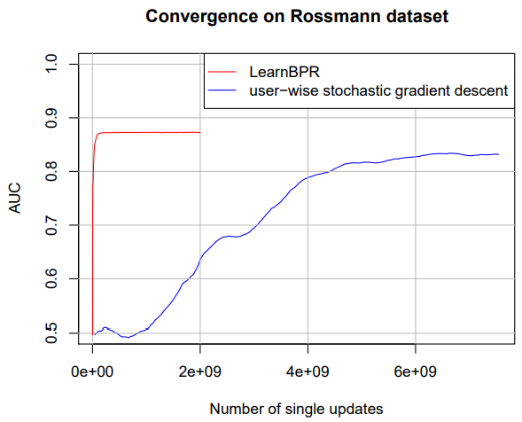

# BPR: Bayesian Personalized Ranking from Implicit Feedback

BPR: 基于隐式反馈的贝叶斯个性化排名

## 摘要

------

物品推荐是预测一组物品（例如网站、电影、产品）的个性化排名的任务。在本文中，我们研究了最常见的带有隐式反馈的场景（例如点击、购买）。有许多方法可以从隐式反馈中进行物品推荐，例如矩阵分解 (MF) 或自适应 k 最近邻 (kNN)。尽管这些方法是为个性化排名的物品预测任务而设计的，但它们都没有直接针对排名进行优化。在本文中，我们提出了一种用于个性化排名的通用优化标准 BPR-OPT，它是从问题的贝叶斯分析得出的**最大后验估计量**。我们还提供了一个通用的学习算法，用于优化关于 BPR-OPT 的模型。学习方法是基于带bootstrap采样的随机梯度下降。我们展示了如何将我们的方法应用于两个最先进的推荐模型：矩阵分解和自适应 kNN。
​	  我们的实验表明，对于个性化排名的任务，我们的优化方法优于 MF 和 kNN 的标准学习技术。结果显示了用正确的标准优化模型的重要性

------

## 1 介绍

​	  内容推荐是许多信息系统中的一项重要任务。例如，像亚马逊这样的在线购物网站为每个客户提供用户可能感兴趣的产品的个性化推荐。其他例子是像 YouTube 这样的视频门户网站，向客户推荐电影。个性化对于可以增加销量或浏览量的内容提供商以及可以更轻松地找到有趣内容的客户来说都很有吸引力。在本文中，我们专注于物品推荐。物品推荐的任务是为一组物品创建特定于用户的排名。用户对物品的偏好是从用户过去与系统的交互中得知的——例如他的购买历史，观看历史等。

​	  推荐系统是一个活跃的研究课题。最近的工作是关于用户提供明确反馈的场景，例如在评分方面。尽管如此，在现实世界的场景中，大多数反馈不是明确的，而是隐含的。隐式反馈是自动追踪的，如对点击、查看时间、购买等的监控。因此收集起来要容易得多，因为用户不必明确表达他的品味。事实上，几乎所有信息系统都已经提供隐式反馈——例如 Web 服务器在日志文件中会记录任何页面访问。

​	  在本文中，我们提出了一种用于学习个性化排名模型的通用方法。主要贡献是：

1. 提出了从最大后验估计器 (estimator)获得的通用优化标准 BPR-OPT，以获得最佳个性化排名。展示了 BPR-OPT 与 ROC 曲线下最大面积的类比。
2. 为了最大化 BPR-OPT，提出了通用学习算法 LEARNBPR，是基于训练三元组的使用bootstrap采样的随机梯度下降。作者表明，对于使用BPR-OPT标准的优化，此算法优于标准随机梯度下降技术。
3. 展示了如何将 LEARNBPR 应用于两个最先进的推荐模型类。
4. 我们的实验表明，对于个性化排序任务，学习一个使用 BPR 的模型优于其他学习方法。

## 2 相关工作

略

## 3 个性化排名

​	  个性化排序的任务是为用户提供一个排好序的物品列表。这也被称为物品推荐。例如，一家在线商店希望推荐用户可能想要购买的个性化商品的排名列表。在本文中，我们研究了必须从用户的隐性行为（例如过去的购买）中推断出排名的场景。隐式反馈系统的有趣之处在于，只有积极的观察是可用的。未观察到的用户-物品对——例如用户尚未购买商品——是真实的负面反馈（用户对购买商品不感兴趣）和缺失值（用户可能想在未来购买商品）的混合。

### 3.1 形式化

​	  设 $U$ 是所有用户的集合，$I$ 是所有物品的集合。在我们的场景中，隐式反馈 $S \subseteq U ×I$ 是可用的（见图 1 左侧）。此类反馈的示例包括在线商店中的购买、视频门户中的观看或网站上的点击。推荐系统的任务现在是为用户提供所有物品的个性化总排名 $>_u \subset I^2$ ，其中 $>_u$ 必须满足一个总标准：
$$
\forall i,j \in I:i\neq j \Rightarrow i>_u j \vee j>_u i
\tag {totality}
$$

$$
\forall i,j \in I: i>_u j \wedge j>_u i \Rightarrow i=j
\tag{antisymmetry}
$$

$$
\forall i,j,k \in I: i>_u j \wedge j>_u k \Rightarrow i>_u k
\tag{transitivity}
$$

为了方便，定义：
$$
I^+ _u:=\{ i \in I:(u,i)\in S\}\\
U^+ _i:=\{ u \in U:(u,i)\in S\}
$$

### 3.2 问题设定的分析

​	  正如我们之前指出的，在隐式反馈系统中只观察到正类。剩余的数据是实际负值和缺失值的混合。处理缺失值问题最常见的方法是忽略所有这些，但是这会导致经典的机器学习模型无法学习任何东西，因为它们无法再区分这两个级别。

​	  物品推荐的常用方法是预测一个物品的个性化分数 $\hat x_{ui}$，该分数反映用户对该物品的偏好。然后根据该分数对物品进行排序，以此对物品进行排名。物品推荐的机器学习方法 [5, 10] 通常通过给用户-物品对 $(u, i) \in S$ 一个正类标签，给所有其他组合 $(U \times I) \setminus S$ 一个负类标签来从 S 创建训练数据（见图1），然后将模型与该数据拟合.这意味着模型经过优化后，对所有S中的元素可以预测值为1，其他所有则预测为0。
这种方法的问题是在未来应该由模型进行排名的所有元素  $(U \times I) \setminus S$ 在训练期间都被当作负反馈呈现给学习算法。这意味着具有足够表达能力（可以精确拟合训练数据）的模型根本无法排名，因为它只会预测 0。这种机器学习方法可以预测排名的唯一原因是防止过拟合的策略，例如正则化。

图1 左侧显示了观察到的数据 S。直接从 S 学习是不可行的，因为只能观察到正反馈。通常负数据是通过用 0 值填充矩阵来生成的。

​	  我们使用不同的方法通过使用物品对作为训练数据并优化来正确排序物品对而不是对单个物品进行评分，因为这比仅用负值替换缺失值更能代表问题。在 $S$ 中我们尝试为每个 $>_u$ 的用户部分进行重建 (reconstruct)。如果用户 $u$ 查看了一个物品 $i$——即 $(u, i) \in S$——那么我们假设 $u$ 相比所有其他未观察到的物品更喜欢这个物品。例如，在图 2 中，用户 $u_1$ 已查看物品 $i_2$ 但未查看物品 $i_1$，因此我们假设该用户更喜欢物品 $i_2$ 而不是 $i_1：i_2 >_u i_1$。对于用户都看过的物品，我们无法推断出任何偏好。对于用户还没有看到的两个物品（例如用户 $u_1$ 的物品 $i_1$ 和 $i_4$）也是如此。为了将其形式化，我们通过以下方式创建训练数据 $D_S : U \times I \times I$：
$$
D_S:= \{(u, i, j)|i \in I^+ _u \wedge j \in I \setminus I^+ _u \}
$$
$(u,i,j) \in D_s$ 表示假设用户 $u$ 相比于 $j$ 更喜欢 $i$ 。由于$>_u$ 是反对称的（注意区分反对称和非对称），负例被隐式地考虑了。

图2：左侧显示了观察到的数据 S。我们的方法在一对物品之间创建用户特定的成对偏好 i >_u j。在右侧，加号 (+) 表示用户更喜欢物品 i 而不是物品 j；减号 (-) 表示他更喜欢 j 而不是 i。

​	  我们的方法由两个优点：

1. 我们的训练数据由正负对和缺失值组成。两个未观察到的物品之间的缺失值正是未来必须排序的物品对。这意味着从成对的角度来看，训练数据 $D_S$ 和测试数据是不相交的。
2. 训练数据是为实际目标——排名而创建的，即观察到的 $>_u$ 的子集 $D_S$ 被用作训练数据。

## 4 贝叶斯个性化排序（BPR）

​	  在本节中，我们推导出解决个性化排名任务的通用方法。它由个性化排名的通用优化标准 BPR-OPT 组成，BPR-OPT将通过使用 $p(i >_u j|\Theta) $的似然函数和模型参数 的先验概率 $p(\Theta)$ 对问题进行贝叶斯分析得出。我们展示了与排名统计 AUC（ROC 曲线下的面积）的类比。对于关于 BPR-OPT 的学习模型，我们提出了算法 LEARNBPR。最后，我们展示了 BPR-OPT 和 LEARNBPR 如何应用于两种最先进的推荐算法：矩阵分解和自适应 kNN。使用 BPR 优化这些模型能够产生比通常的训练方法更好的排名

### 4.1 BPR优化

​	  为所有物品 $i \in I$ 找到正确的个性化排名的贝叶斯公式是**最大化以下后验概率**，其中 $\Theta$ 表示任意模型的参数向量（例如矩阵分解）。
$$
p(\Theta|>_u) \propto p(>_u|\Theta)p(\Theta)
$$
这里，$>_u$ 是用户 $u$ 期望但潜在的(desired but latent)偏好结构(preference structure)。所有用户都被假定为彼此独立行动。我们还假设特定用户的每对物品 $(i,j)$ 的排序与其他每对的排序无关。
因此，上述特定于用户的似然函数 $p(>_u |\Theta)$ 可以首先重写为单个密度的乘积，然后针对所有用户 $u ∈ U$ 进行组合。
$$
\prod_{u \in U} p(>_u| \Theta)=
\prod_{\{u,i,j\}\in U\times I \times I}
p(i>_u j|\Theta)^{\delta((u,i,j)\in D_s)}
\cdot (1-p(i>_u j|\Theta))^{\delta((u,j,i)\notin D_s)}
$$
其中，$\delta$ 是指示函数 (indicator function)：
$$
\delta(b):=\begin{cases}
1 & {\rm if}\ b\ {\rm is\ true}, \\
0 & \rm else
\end{cases}
$$
由于sound的成对排序方案的整体性 (totality)和反对称性，上述公式可以简化为：
$$
\prod_{u \in U} p(>_u| \Theta)=
\prod_{\{u,i,j\}\in D_s}p(>_u j| \Theta)
$$
​	  到目前为止，通常不能保证获得个性化的总顺序。为了建立这个，需要满足所有已经提到的sound属性（整体性、反对称性和传递性）。为此，我们将用户相比物品 $j$ 真正更喜欢物品 $i$ 的个性化概率定义为
$$
p(i>_u j|\Theta):=\sigma(\hat x_{uij}(\Theta))
$$
其中，$\sigma$ 是logistic sigmoid:
$$
\sigma(x)=\frac{1}{1+e^{-x}}
$$
这里 $\hat x_{uij}(\Theta)$ 是模型参数向量 $\Theta$ 的任意实值函数，它捕捉用户 $u$、物品 $i$ 和物品 $j$ 之间的特殊关系。换句话说，我们的通用框架将建模 $u$、$i$ 和 $j$ 之间关系的任务委托给底层模型类，例如矩阵分解或自适应 kNN（负责估计 $\hat x_{uij}(\Theta)$ ）。因此，对个性化的总顺序 $>_u$ 进行统计建模变得可行。为方便起见，下面我们将跳过 $\hat x_{uij}$ 中的参数 $\Theta$。

​	  到目前为止，我们只讨论了似然函数。为了完成个性化排名任务的贝叶斯建模方法，我们引入了通用先验密度 $p(\Theta)$，它是具有零均值和方差-协方差矩阵 $\sum_\Theta$ 的正态分布：$p(\Theta)\sim N(0, \sum_{\Theta})$ 。

​	  在下文中，为了减少未知超参数的数量，我们设置 $\sum_\Theta = \lambda_ \Theta I$。 现在我们可以模拟最大后验估计器来推导出我们的个性化排名 BPR-OPT 的通用优化标准。
$$
\begin {align}
{\rm BPR-OPT}:&=\ln p(\Theta|>_u)\\
&=\ln p(>_u |\Theta)p(\Theta)\\
&=\ln \prod_{(u,i,j)\in D_s} \sigma(\hat x_{uij})p(\Theta)\\
&=\sum_{(u,i,j)\in D_s} \ln \sigma(\hat x_{uij})+ \ln p(\Theta)\\
&=\sum_{(u,i,j)\in D_s} \ln \sigma(\hat x_{uij})-\lambda_\Theta||\Theta||^2
\end {align}
$$
其中$\lambda_\Theta$ 是模型的具体正则化参数。

#### 4.2 与AUC优化的类比

​	  通过贝叶斯个性化排名 (BPR) 方案的这种表述，现在很容易掌握 BPR 和 AUC 之间的类比。每个用户的AUC定义如下：
$$
{\rm AUC}(u):=\frac{1}{|I^+_u||I \setminus I^+_u|}
\sum_{i \in I^+_u}
\sum_{j \in I \setminus I^+_u}
\delta(\hat x_{uij}>0)
$$
因此平均ACU是
$$
{\rm AUC}=\frac{1}{|U|}
\sum_{u \in U}AUC(u)
$$
用我们的符号 $D_S$ 就可以写成
$$
{\rm AUC}(U)=\sum_{(u,i,j) \in D_s}
z_u \delta(\hat x_{uij}>0)
\tag1
$$
其中 $z_u$ 是正则化常数
$$
z_u = \frac{1}{|U||I^+_u||I \setminus I^+_u|}
$$
​	  (1) 和 BPR-OPT 之间的类比是显而易见的。
除了归一化常数 $z_u$ 之外，它们仅在损失函数上有所不同。  AUC 使用与 Heaviside 函数相同的不可微损失 $\delta(x > 0)$：
$$
\delta (x>0)=H(x):=
\begin{cases}
1, &x>0\\
0, &\rm else
\end{cases}
$$
相反，我们使用可微损失 $\ln \sigma(x)$。 在优化 AUC [3] 时，通常的做法是替换不可微的 Heaviside 函数。 通常，替代的选择是启发式 (heuristic)，并且使用形状类似 $\sigma$ 的函数（见图 3）。 在本文中，我们推导出了由 MLE 驱动的可选替代 $\ln \sigma(x)$。

图3：用于优化AUC的损失函数。不可微的Heaviside函数 H(x)通常近似为sigmoid函数σ(x) 。 我们的 MLE 推导建议使用 ln σ(x) 代替

### 4.3 BPR学习算法

​	  在上一节中，我们推导出了个性化排名的优化标准。 由于标准是可微的，一个明显的选择是基于梯度下降的算法用于最大化。 但正如我们将看到的，标准梯度下降并不是解决我们问题的正确选择。 为了解决这个问题，我们提出了 LEARNBPR，这是一种基于训练三元组bootstrap抽样的随机梯度下降算法（见图 4）。

图4 使用基于 bootstrap 的随机梯度下降优化 BPR 模型。 使用学习率 α 和正则化 λΘ。

​	  首先，BPR-OPT关于模型参数的梯度是：
$$
\begin{align}
\frac{\partial \rm BPR-OPT}{\partial \Theta}&=
\sum_{(u,i,j)\in D_S} \frac{\partial}{\partial \Theta} \ln \sigma (\hat x_{uij})
-\lambda_\Theta \frac{\partial}{\partial \Theta} ||\Theta||^2\\
& \propto \sum_{(u,i,j) \in D_S}
\frac{-e^{-\hat x_{uij}}}{1+e^{-\hat x_{uij}}} \cdot
\frac{\partial}{\partial \Theta} \hat x_{uij}-
\lambda_{\Theta}\Theta
\end {align}
$$
两种最常见的梯度下降算法是完全梯度下降或随机梯度下降。 在第一种情况下，在每个步骤中，计算所有训练数据的完整梯度，然后使用学习率 α 更新模型参数：
$$
\Theta \leftarrow \Theta-\alpha\frac{\partial \rm BPR-OPT}{\partial \Theta}
$$
一般来说，这种方法会导致向“正确”的方向下降，但收敛速度很慢。 由于我们在 DS 中有 $O(|S| |I|)$ 训练三元组，因此在每个更新步骤中计算完整梯度是不可行的。 此外，使用全梯度去优化 BPR-OPT，训练对的偏度也会导致收敛性不佳。 想象一个通常是正的物品 $i$ ，然后我们在损失中有许多形式为 $\hat x_{uij}$ 的项，因为对于许多用户 u，会将物品 $i$ 与所有负面物品 $j$（主导类）进行比较。因此，依赖于 $i$ 的模型参数的梯度将在很大程度上主导梯度。 这意味着必须选择非常小的学习率。 其次，由于梯度差异很大，很难正则化。

​	  另一种流行的方法是随机梯度下降。在这种情况下，对于每个三元组 $(u,i,j) \in D_S$ 执行更新。
$$
\Theta \leftarrow \Theta+\alpha \Big(\frac{e^{-\hat x_{uij}}}{1+e^{-\hat x_{uij}}} \cdot \frac{\partial}{\partial \Theta} \hat x_{uij} + \lambda_{\Theta} \Theta\Big)
$$
一般来说，这是解决我们的偏度问题的好方法，但遍历训练对的顺序至关重要。 一种典型的逐项或逐用户遍历数据的方法会导致收敛性不佳，因为在同一用户-物品对上有太多连续的更新——即，对于一个用户-物品对 $(u, i)$ 有很多 $(u,i,j) \in D_S$ 有太多的 $j$。

​	  为了解决这个问题，我们建议使用随机梯度下降算法来选择随机（均匀分布）的三元组。 使用这种方法，在连续更新步骤中选择相同用户-物品组合的机会很小。 我们建议使用带替换的bootstrap抽样方法，因为可以在任何步骤停止。 放弃完整循环数据的想法在我们的案例中特别有用，因为示例的数量非常多，并且对于收敛而言，完整循环的一小部分就足够了。我们根据观察到的正反馈 $S$ 的数量线性地选择评估中的单步的步数。

​	  图 5 显示了典型的逐用户随机梯度下降与我们的方法：带bootstrap的LEARNBPR 的比较。该模型是具有 16 个维度的 BPR-MF。 可见 LEARNBPR的收敛速度比逐用户梯度下降要快得多。

### 4.4 使用BPR的学习模型

​	  在下文中，我们将描述两个SOTA的推荐模型，以及我们如何使用我们提出的 BPR 方法来学习它们。 我们选择了两个不同的矩阵分解 [5, 12] 模型和学习的 k-最近邻 [8] 模型。 这两个模型都试图将用户对某个物品的隐藏偏好进行建模。他们的预测是每个用户-物品对 $(u, l)$ 的一个实数 $\hat x_{ul}$。

​	  因为在我们的优化中我们有三元组 $(u,i,j) \in D_S$，我们首先分解估计量 $\hat x_{uij}$ 并将其定义为：
$$
\hat x_{uij}:=\hat x_{ui}-\hat x_{uj}
$$
现在我们可以应用任何标准的协同过滤模型来预测 $\hat x_{ul}$。

​	  注意，即使我们使用与其他工作相同的模型，我们也会根据另一个标准对其进行优化，这将导致更好的排名，因为我们的标准对于排序任务是最佳的。我们的标准不会尝试将单个预测变量 $\hat x_{ul}$ 回归到单个数字，而是尝试对两个预测的差异 $\hat x_{ui} − \hat x_{uj}$ 进行分类。

#### 4.4.1 矩阵分解

预测 $\hat x_{ui}$ 的问题可以看作是估计矩阵$X:U \times I$。通过矩阵分解，目标矩阵 $X$ 近似为两个低秩矩阵的乘积：$W:|U| \times k$ 和 $H: |I| \times k$：
$$
\hat X:=W H^t
$$
其中 $k$ 是近似的维度/排名。 $W$ 中的每一行 $w_u$ 都可以看作是一个描述用户 $u$ 的特征向量，类似地，$H$ 中的每一行 $h_i$ 描述一个物品 $i$。 因此预测公式也可以写成：
$$
\hat x_{ui}=\big<w_u, h_i\big>
=\sum_{f=1}^k w_{uf} \cdot h_{if}
$$
除了点积 $\big<·,·\big>$ ，通常任何内核都可以像 [11] 中那样使用。矩阵分解的模型参数为 $\Theta = (W, H)$。模型参数也可以看作是潜在变量，是对用户的未被观察到的品味 (taste)和物品的未被观察到的属性的建模。

​	  一般来说，关于最小二乘法的 $\hat X$ 到 $X$ 的最佳近似是通过奇异值分解 (SVD) 实现的。对于机器学习任务， SVD 过拟合已是常识，因此已经提出了许多其他矩阵分解方法，包括正则化最小二乘优化、非负分解、最大边际分解等。

​	  对于排序任务，即估计用户是否更喜欢一个物品而不是另一个物品，更好的方法是针对 BPR-OPT 标准进行优化，这可以通过使用我们提出的算法 LEARNBPR 来实现。如前所述，为了使用 LERANBPR 进行优化，只需知道与每个模型参数 $θ$ 相关的 $\hat x_{uij}$ 的梯度。对于矩阵分解模型，导数为：
$$
\frac{\partial}{\partial \theta} \hat x_{uij}=\begin{cases}
(h_{if}-h_{jf}) & {\rm if} \ \theta=w_{uf},\\
w_{uf} & {\rm if} \ \theta=h_{if},\\
-w_{uf} & {\rm if} \ \theta=h_{jf},\\
0 & \rm else
\end{cases}
$$
​	  此外，我们使用三个正则化常数：一个 $λ_W$ 用于用户特征 $W$； 对于物品特征 $H$，我们有两个正则化常数，$λ_{H+}$ 用于 $h_{if}$ 的正更新，$λ_{H−}$ 用于 $h_{jf}$ 的负更新。

#### 4.4.2 自适应 kNN

​	  最近邻方法在协同过滤中非常流行。它们依赖于物品（基于物品）或用户（基于用户）之间的相似度的度量。下面我们描述基于物品的方法，因为它们通常提供更好的结果，但基于用户的方法工作类似。 思路是，对用户 $u$ 和物品 $i$ 的预测取决于 $i$ 与用户过去看到的所有其他物品的相似度——即 $I^+_u$ 。 通常只考虑  $I^+_u$ 中最相似的 k 个物品——k 个最近邻。如果仔细选择物品之间的相似度，还可以与 $I^+_u$ 中的所有物品进行比较。对于物品预测，基于物品的 kNN 模型是：
$$
\hat x_{ui} = \sum_{l \in I^+_u \wedge l\neq i} c_{il}
$$
其中 $C : I \times I$ 是对称物品相关性/物品相似度矩阵。 因此 kNN 的模型参数为 $\Theta = C$。

​	  选择 $C$ 的常用方法是应用启发式相似度度量，例如余弦向量相似度：
$$
c_{i,j}^{cosine}:=\frac{|U^+_i \cap U^+_j|}{\sqrt{|U^+_i|\cdot |U^+_j|}}
$$
更好的策略是通过学习使相似度度量 $C$ 与问题相适应。 这可以通过直接使用 $C$ 作为模型参数来完成，或者如果物品数量太大，可以学习 $C$ 的分解 $HH^t$ 和 $H : I \times k$。 在下面以及我们的评估中，我们使用第一种直接学习 $C$ 的方法，而不对其进行因式分解。

​	  再次为了优化 kNN 模型进行排序，我们应用了 BPR 优化标准并使用了 LEARNBPR 算法。应用该算法， $\hat x_{uij}$ 关于模型参数 $C$ 的梯度为：
$$
\frac{\partial}{\partial \theta} \hat x_{uij}=\begin{cases}
+1 & {\rm if} \ \theta \in \{ c_{il},c_{li}\} \wedge l \in I^+_u \wedge l \neq i,\\
-1 & {\rm if} \ \theta \in \{ c_{jl},c_{lj}\} \wedge l \in I^+_u \wedge l \neq j,\\
0 & \rm else
\end{cases}
$$
我们有两个正则化常数，$λ_+$ 用于更新 $c_{il}$，而 $λ_−$ 用于更新 $c_{jl}$

## 5 与其他方法的关系

略

## 附记

当初为了理解BPR，参考了[推荐系统中的BPR算法 - 知乎 (zhihu.com)](https://zhuanlan.zhihu.com/p/60704781) 这篇文章的内容，有兴趣的读者也可以去看看，一下是对基于这篇文章对本文做的一点补充。

​	  BPR有两个基本假设：

- 每个用户之间的偏好行为相互独立，即用户 u 在商品 i 和 j 之间的偏好和其他用户无关。
- 同一用户对不同物品的偏序相互独立，也就是用户 u 在商品 i 和 j 之间的偏好和其他的商品无关。

​	  BPR算法的基本思想是利用**最大化后验概率**来确定所有item：$i \in I$ 的正确个性化排序，我们不妨假设正确的个性化排序可以由某个模型（如矩阵分解）给出，而θ表示这个模型的参数向量，于是我们优化的目标就是使得 $p(\Theta|>_u)$ 最大，进而求出 $\Theta$ 。

​	  根据贝叶斯公式得：
$$
P(\Theta | >_u)=\frac {P(>_u |\Theta)P(\Theta)}{P(>_u)}
$$
因为BPR假设用户的排序和其他用户无关，那么对于任意一个用户 u 来说，$P(>_u)$ 对所有的物品都为一个常数，所以最大化 $P(\Theta | >_u)$ 等价于最大化 $P(>_u |\Theta)P(\Theta)$ ，这个最大化目标分为两部分，左边的部分与数据集有关，右边部分P（θ）与数据集无关。

先最大化左边
$$
\prod_{u \in U} p(>_u| \Theta)=
\prod_{\{u,i,j\}\in U\times I \times I}
p(i>_u j|\Theta)^{\delta((u,i,j)\in D_s)}
\cdot (1-p(i>_u j|\Theta))^{\delta((u,j,i)\notin D_s)}
$$
其中，$\delta$ 是指示函数 (indicator function)：
$$
\delta(b):=\begin{cases}
1 & {\rm if}\ b\ {\rm is\ true}, \\
0 & \rm else
\end{cases}
$$
进而上式简化为
$$
\prod_{u \in U} p(>_u| \Theta)=
\prod_{\{u,i,j\}\in D_s}p(>_u j| \Theta)
$$
而 $p(i>_u j| \Theta)$ 被定义为：
$$
p(i>_u j|\Theta):=\sigma(\hat x_{uij}(\Theta))
$$
$\sigma$ 是sigmoid函数，$\hat x_{uij}(\Theta)$ 是关于模型参数向量θ的实值函数，该函数能映射出用户u与物品i和j之间的关系

​	  第二部分 $p(\Theta)$, 由于θ的分布是未知的，为了方便计算，假设$p(\Theta)\sim N(0, \sum_{\Theta})$

