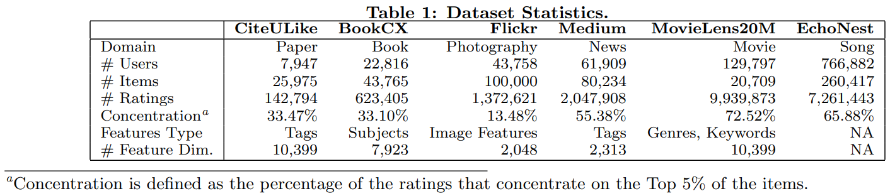

# 【推荐系统论文笔记】Collaborative Metric Learning

Collaborative Metric Learning 协同度量学习

## 摘要

度量学习算法产生的距离度量可以捕捉数据之间的重要关系。在这项工作中，我们研究了度量学习和协同过滤之间的联系。 我们提出了协同度量学习 (CML)，它学习联合度量空间 (joint metric space)，不仅可以对用户的偏好进行编码，还可以对用户-用户和物品-物品的相似性进行编码。 该算法在广泛的推荐任务上优于最先进的协同过滤算法，并揭示了用户细粒度偏好的潜在特征。  CML 还使用现成的、近似的最近邻搜索为 Top-K 推荐任务实现了显着的加速，同时准确度的降低微乎其微。

## 1 介绍

距离的概念是许多基本机器学习算法的核心，包括 K-最近邻、K-means 和 SVM。 度量学习算法产生一个距离度量来捕捉数据之间的重要关系，是许多成功的机器学习应用不可或缺的技术，包括图像分类、文档检索和蛋白质功能预测。[43、45、26、52、32]。 在本文中，我们将度量学习应用于协同过滤问题，并将其与最先进的协同过滤方法进行比较。

给定一组对象，其中我们知道某些对象对是“相似的”或“不相似的”，度量学习的目标是学习遵循这些关系的距离度量。 具体来说，我们想学习一个度量，它在相似对之间分配较小的距离，而在不同对之间分配较大的距离。 例如，在人脸识别中，我们可能希望学习一个度量，根据图像像素[43, 29]，将小距离分配给真实（相同身份）人脸对，将大距离分配给冒充的（不同身份）对。

从数学上讲，度量需要满足几个条件，其中三角不等式对于泛化学习度量最关键 [29, 51]。 三角不等式指出，对于任何三个对象，任何两个成对距离的总和应大于或等于剩余的成对距离。 这意味着，给定信息：“$x$​​ 与 $y$​​ 都和 $z$​​​ 相似”，学习的度量不仅会将所述的两对 ($x,y$​​和$x,z$​​) 拉得更近，还会将剩余的对 ($y, z$​​​) 拉得相对更近。（注释1：$(y,z)的距离被(x,y)的距离和(x,z)的距离之和限制：d(y,z)\leq d(x,y)+d(x,z)$​​） 我们可以将其视为一个相似性传播过程，其中学习到的度量将已知的相似性信息传播到关系未知的对。

这种相似性传播的概念与协同过滤 (CF) 密切相关。在协同过滤中，我们还观察了某些 (user, item)对之间的关系，即用户对物品的评分，并希望将此信息推广到其他不可见的对 [31, 40]。 例如，最著名的 CF 技术矩阵分解使用用户/物品向量之间的点积来捕获已知评分，并使用这些向量的点积来预测未知评分 [25]。

然而，尽管它们的概念相似，但在大多数情况下，矩阵分解不是一种度量学习方法，因为点积不满足关键的三角不等式 [36, 42]。 正如我们将在第 3.6 节中说明的那样，尽管矩阵分解可以捕获用户的一般兴趣，但当违反三角不等式时，它可能无法捕获更细粒度的偏好信息，从而导致性能欠佳，如第 4 节所示。此外，虽然我们可以使用矩阵分解系统来预测评分，但我们无法可靠地确定用户-用户和物品-物品之间的关系，这极大地限制了结果模型的可解释性。（注释2：一个常见的启发式方法是测量潜在向量的余弦相似度，但是当三角不等式不满足时，这种启发式会导致误导结果，如第 3.6 节所示。）

在本文中 ，我们提出了协作度量学习（CML），它学习了一个联合的用户-物品度量，不仅对用户的偏好进行编码，而且对用户-用户和物品物品的相似性进行编码。 我们专注于隐式反馈的协同过滤问题，并表明 CML 自然地捕获了这种关系，并且在广泛的推荐领域（包括书籍、新闻和摄影）中优于最先进的算法 ，纯基于评分的 CF 的召回率高达 13.95%，带有内容信息的 CF 的召回率高达 17.66%。

除了准确性的提高之外，CML 的一个令人兴奋的特性是它能够揭示用户偏好之间的细粒度关系。 在第 4.5 节中，我们使用 Flickr 摄影数据集演示了此功能。我们说明了学习的度量的可视化如何揭示用户对不同场景和对象的偏好，并揭示了用户偏好的潜在 spectrum。

通过对模型的概率解释，我们展示了 CML 集成各种类型的物品特征的能力，包括图像、文本和标签 (tags)。 最后，我们还证明了使用现成的局部敏感哈希 (LSH) 可以将 CML 的 Top-K 推荐任务的效率提高 2 个数量级以上，而准确率的降低可以忽略不计[4]。（注释3：矩阵分解也可以通过专门设计的非对称哈希 [42] 来加速。 我们在第 4.4 节中提供了一个比较）

本文的其余部分组织如下。 在第 2 节中，我们回顾了有关度量学习和协同过滤的相关先前工作。 在第 3 节中，我们提出了我们的 CML 模型以及一套正则化和训练技术。 在第 4 节中，我们相对于最先进的推荐算法评估 CML，并展示学习的度量如何揭示用户的细粒度偏好。 在第 5 节中，我们总结并讨论了未来的工作。

## 2 背景

### 2.1 度量学习

令 ${\cal X}=\{x_1, x_2,...,x_n\}$​​ 为输入空间 ${\mathbb R}^m$​​​​ 上的一个数据集合。度量学习中的 label 信息以成对约束的形式指定，包括已知相似对的集合，表示为
$$
S=\{(x_i,x_j)| x_i \ {\rm and} \ x_j \ {\rm are \ considered \ similar } \}
$$
不相似对的集合被表示为
$$
D=\{(x_i,x_j)| x_i \ {\rm and} \ x_j \ {\rm are \ considered \ dissimilar } \}
$$
最原始的度量学习方法尝试学习 Mahalanobis 距离度量
$$
d_A(x_i,x_j)=\sqrt{(x_i-x_i)^T A(x_i-x_j)}
$$
其中 $A \in {\mathbb R}^{m\times m}$​ 是一个半正定矩阵[51]。这相当于将每个输入 $x$​ 投影到一个新空间 ${\mathbb R}^m$​ ，其中它们的欧几里得距离服从所需的约束。 有许多不同的方法可以创建这样的指标。 最原始的方法是全局解决以下凸优化问题：
$$
\begin{align}
&\min_A \sum_{(x_i,x_j) \in S} d_A(x_i,x_j)^2 \\
&{\rm s.t.} \sum_{(x_i,x_j)\in D} d_A(x_i,x_j)^2 \geq1 \ {\rm and\ } A\succeq 0.
\end{align}
$$
最近的方法倾向于使用非线性变换函数，例如核技巧或神经网络，来提高度量精度 [49, 48, 8, 21]。

### 2.2 度量学习用于kNN

上述全局优化本质上试图学习一个距离度量，将所有相似的对拉到一起，并将不同的对分开。 然而，这个目标并不总是可行的。 另一方面，Weinberger等人表明如果学习的度量要用于 k-最近邻分类，只需学习一个度量就足够了，该度量使每个对象的 k-最近邻成为与该对象同属一类 label 的对象（与将所有相似的对象聚集在一起形成对照）[49]。 这个目标更容易实现，我们在模型中采用了这种宽松的度量学习概念，因为我们的目标也是找到要推荐给每个用户的 kNN 物品。

具体来说，给定输入 $x$，我们将所希望的最接近 $x$​ 的数据点称为其目标邻居。 我们可以想象 $x$ 的目标邻居建立了一个边界，不同 label 的输入不应该侵入。 侵入边界的不同 label 的输入被称为 imposter 。 一般来说，学习的目标是学习一个最小化 imposter 数量的度量[49]。

这种类型最著名的模型之一是大边距最近邻 (large margin nearest neighbor, LMNN) [49]，它使用两个损失项来表达这个想法。 具体来说，LMNN 定义了一个 $pull \ loss$​，它将输入 $x$ 的目标邻居拉得更近：
$$
{\cal L}_{pull}(d)=\sum_{j \leadsto i}d(x_i, x_j)^2
$$
其中 $j \leadsto i$ 表示输入 $j$ 是输入 $i$ 的邻居。此外，LMNN 定义了 $push \ loss$ ，使得 imposter 远离邻居并在 kNN 决策边界周围保持安全边际：
$$
{\cal L}_{push}(d)=\sum_{i,j\leadsto i}\sum_k (1-y_{ik})[1+d(x_i,x_j)^2-d(x_i,x_k)^2]_+
$$
其中指示函数：当$i$ 和 $k$ 属于同一类时 $y_{ik}=1$ ，否则 $y_{ik}=0$ ，以及$[z]_+=\max(z,0)$ 是标准 hinge loss。LMNN 的完整损失函数是 ${\cal L}_{pull}(d)$ 和 ${\cal L}_{push}(d)$ 的加权组合，可以通过半定规划 (semidefinite programming) 进行优化。

### 2.3 协同过滤

我们现在将注意力转向协同过滤 (CF)，特别是具有隐式反馈的协同过滤。传统的协同过滤算法是基于启发式计算的用户相似度，如余弦相似度。 其推荐是通过聚合与 query 用户最相似的 K-nearest 用户的评分做出的 [40, 31]。

在过去十年中，矩阵分解 (MF) 因其卓越的性能而成为最受欢迎的 CF 方法 [25, 19, 1]。 最初的 MF 模型被设计为通过将用户和物品映射到潜在因子空间来对用户的显式反馈建模，这样用户-物品关系（即评分）可以通过他们的潜在因子的点积来捕获。 具体来说，让 $r_{ij}$​ 表示用户 $i$​ 对物品 $j$​ 的评价，我们学习用户向量 ${\bold u}_i ∈ {\mathbb R}^r$​ 和物品向量  ${\bold v}_j ∈ {\mathbb R}^r$​  ，这样他们的点积 ${\bold u}_i^T{\bold v}_j$​ 近似于 $r_{ij}$​​​ [25]。 这个公式引出优化问题，最小化已知评分集合的均方误差 (MSE)，
$$
\min_{${\bold u}_*, ${\bold v}_*} 
\sum_{r_{ij} \in \cal K}
(r_{ij}-{\bold u}_i^T{\bold v}_j)^2 + 
\lambda_u||{\bold u}_i||^2 + \lambda_v ||{\bold v}_j||^2
$$

其中 $\cal K$​ 是已知评分的集合；  $\lambda_u$​ 和 $\lambda_v$​ 是用于正则化 ${\bold u}_*$​ 和 ${\bold v}_*$​ 的 L2范数的超参数。

#### 2.3.1 隐式反馈

除了显式反馈外，还有许多其他信号可用于推断用户的偏好，例如喜欢、书签、点击等，统称为隐式反馈 [19, 38]。 与显式反馈相比，隐式反馈通常更丰富且偏差更小 [22, 20]，并且在研究界受到了广泛关注 [19, 35, 38, 3, 46, 16]。

然而，将传统的矩阵分解应用于隐式反馈是有问题的，主要有两个原因：首先，对于隐式反馈，我们只观察到正反馈（即，$r_{ij} = 1，\forall r_{ij} ∈ \cal K$​​​）。 我们不能忽略未观察到的用户-物品交互，否则它会导致不重要但无用的解决方案（例如，将所有潜在向量折叠到一个点）。 此外，我们也不能假设这些未观察到的交互是负面的，因为我们不知道这些交互没有发生是不是因为用户不喜欢该物品或用户不知道它[19]。

为了解决这些问题，Hu等人和Pan等人提出加权正则化矩阵分解 (WRMF) [19, 35] ，将所有未观察到的用户-物品交互视为负样本，并使用case weight $c_{ij}$​ 来减少这些不确定样本的影响，即
$$
\min_{${\bold u}_*, ${\bold v}_*} 
\sum_{r_{ij} \in \cal K} 
c_{ij}(r_{ij}-{\bold u}_i^T{\bold v}_j)^2 + 
\lambda_u||{\bold u}_i||^2 + \lambda_v ||{\bold v}_j||^2
$$
其中case weight $c_{ij}$ 对于观察到的正反馈较大，对于未观察到的相互作用较小。

#### 2.3.2 贝叶斯个性化排序（BPR）

正如上面的讨论所示，对于隐式反馈，“评分”的概念变得不那么准确。 因此，最近的矩阵分解模型开始从估计一组特定的评分转向建模不同物品之间的相对偏好（或顺序）。  Rendle等人[38]提出的贝叶斯个性化排序（BPR）是这种类型的一个著名例子。
设 $\cal D_i$​​ 是一组物品对 $(j,k)$，其中用户 $i$ 与物品 $j$ 有交互但与物品 $k$ 没有交互，假设用户 $i$​ 可能对物品 $j$ 比物品 $k$ 更感兴趣，BPR 最小化pair-wise排序损失：
$$
\min_{${\bold u}_*, ${\bold v}_*} 
\sum_{i \in \cal I}
\sum_{(j,k) \in \cal D_i}
-\log \sigma({\bold u}_i^T{\bold v}_j-{\bold u}_i^T{\bold v}_k)^2 + 
\lambda_u||{\bold u}_i||^2 + \lambda_v ||{\bold v}_j||^2
$$
其中 $\sigma$​ 是sigmoid函数。

通过这个损失函数，BPR 本质上是试图最小化预测用户喜欢的一对物品之间的误差。 这个损失函数也相当于对每个用户优化 ROC 曲线下面积（AUC）[39]。 然而，BPR 损失的一个问题是它没有充分惩罚处于较低排名的物品。 对于 Top-K 推荐任务，其产生的是次优结果，其中只有在 Top-K 内排名的物品才重要 [53]。 改进 Top-K 推荐的一种流行方法是采用加权排序损失，以惩罚较低排名的正项 [50, 27, 28]，这将在第 3.2 节中进一步描述。

## 3 协同度量学习

上述讨论强调了这样一个事实，即通过从显式反馈转向隐式反馈，协同过滤的重点不再是估计特定的评分矩阵，而是捕获用户对不同物品的相对偏好。
在本节中，我们将 CML 描述为捕获此类相对关系的更自然的方式。  CML 的高级思想如下：我们将观察到的隐式反馈建模为一组我们已知具有正关系的用户-物品对 $\cal S$，并学习一个用户-物品联合度量来编码这些关系。 具体来说，学习的度量将 $\cal S$​​​​ 中的对拉得更近，并将其他对推得相对更远。 由于三角不等式，这个过程也会聚类 1) 共同喜欢 (co-like) 相同物品的用户，以及 2) 相同用户共同喜欢的物品。最终，任何给定用户的最近邻物品将变为：

- 该用户以前喜欢的物品，以及
- 以前与该用户具有相似品味的其他用户喜欢的物品。

换句话说，通过学习遵循已知正关系的度量，我们不仅将这些关系传播到其他用户-物品对，而且还将这些关系传播到那些我们没有直接观察到这种关系的用户-用户和物品-物品对。 下面，我们更正式地表述这个想法。

### 3.1 模型公式

我们用用户向量 $\bold u_i ∈ \cal R^r$​​ 和物品向量  $\bold v_j ∈ \cal R^r$​​​  表示每个用户和每个物品。 我们以欧氏距离的方式学习这些向量，即
$$
d(i,j)=||\bold u_i-\bold v_j||
$$
这个欧式距离将服从用户 $i$ 对不同物品的相对偏好，即该用户喜欢的物品将比他不喜欢的其他物品更接近该用户。 我们使用以下损失函数来制定这样的约束：
$$
{\cal L_m(d)}=\sum_{(i,j) \in {\cal S}} \sum_{(i,k) \notin {\cal S}}
w_{ij}[m+d(i,j)^2-d(i,k)^2]_+
\tag1
$$
其中 $j$ 是用户 $i$ 喜欢的物品，$k$ 是他不喜欢的物品；$ [z]_+ = max(z, 0) $表示标准 hinge 损失，$w_{ij}$ 是排序损失权重（稍后介绍），$m > 0$​​​​​​ 是安全边距大小 (safety margin size)。

图 1 说明了此损失函数产生的梯度。对于用户喜欢的物品，它们的梯度向内移动以创建更小的半径。 对于 imposter 物品，即用户不喜欢但侵入边界 (perimeter) 的物品，它们的梯度从用户向外移动，直到它们被推离边界且距离大于安全边距。

该损失函数类似于 LMNN 的损失函数，但有三个重要区别：

- 每个用户的目标邻居都是他喜欢的物品，物品没有目标邻居。
- 我们没有 $\cal L_{pull}$​ 项，因为一个物品可以被许多用户喜欢，将它拉近所有用户是不可行的。 然而，当有 imposter 时，我们的 $push \ loss$​​ 会将正物品拉近用户。
- 我们采用加权排序损失来改进下一小节中描述的 Top K 推荐。

### 3.2 近似的排序权重

我们使用 Weston 等人[50]提出的基于排名的加权方案，称为加权近似排名成对 (Weighted Approximate-Rank Pairwise, WARP) 损失，惩罚较低排名的物品。 给定一个度量 $d$​​，令 $J$​​ 表示物品的总数， $rank_d(i, j)$​​ 表示物品 $j$​​ 在用户 $i$​​ 的推荐结果中的排名 (注释5：$0 \leq rank_d(i,j) < J$​，且最靠前的物品 $rank_d(i,j)=0$​ )，我们通过以下设置基于它的排名来惩罚正物品 $j$​​
$$
w_{ij}=\log (rank_d(i,j)+1)
$$
该方案对较低排名的正物品的惩罚比排名前几的要严重得多，并在许多先前的工作[50, 53, 28]中产生了SOTA的结果 。 然而，在每个梯度下降步骤计算 $rank_d(i, j)$​​ 的代价相当高。

Weston 等人建议通过连续采样程序来估计 $rank_d(i, j)$，该程序重复采样一个负面物品，直到我们找到一个 imposter  [50]。 具体来说，让 $N$ 表示我们需要采样的负面物品的数量，以找到等式1中具有非零损失的 imposter  $k$。然后将 $rank_d(i, j)$ 近似为 $\lfloor \frac{J}{N} \rfloor$ 。 这个过程类似于目标检测中常用的负样本挖掘，其中简单但非信息性的负样本在训练集中占主导地位[7]。 负样本的数量 $N$ 通常以常数 $U = 10$ 或 $20$ 为界，以避免延长采样时间 [27, 53]。 然而，在我们的工作中，我们用并行程序替换了这个顺序程序，以利用现代 GPU 支持的大规模并行性：

1. 对于每个 user-item 对 $(i, j)$，并行采样 $U$​ 个 negtive item 并计算公式1中的 Hinge 损失。
2. 令 $M$​​​​ 表示 $U$​​​​ 个样本中的 imposter 数量，$rank_d(i, j)$​​​​ 则近似为 $\lfloor \frac{J \times M}{U} \rfloor$​​​​ 

总是采样 U 个负物品似乎很浪费。然而，根据经验，我们发现 CML 在前几个 epoch 之后相当快地将正项推到了高位。因此，在大多数情况下，我们需要对相似数量的负物品进行采样以找到冒名顶替者，即使采用串行程序也是如此。

### 3.3 集成物品特征

如第 2.1 节所述，度量学习的原始思想是学习一个转换函数 $f$​​，将原始输入投影到欧几里得空间 [51]。 我们采用类似的想法来集成推荐系统中通常可用的物品特征，例如物品的文本描述、标签 (tags) 或图像像素。 让 $\bold x_j \in \cal R^m$​​ 表示物品 $j$​​ 的 $m$​​ 维原始特征向量，如图 2 所示，我们学习了一个转换函数 $f$​​ ，它将 $\bold x_j$​​ 投影到前面描述的联合用户-物品空间。 由于投影 $f(\bold x_j)$​​ 应该在某种程度上捕捉物品 $j$​​ 的特征，因此当 $\bold v_j$​​ 偏离  $f(\bold x_j)$​​ 时，我们惩罚物品 $j$​​ 在空间中的最终位置（即 $\bold v_j$​​ ）。具体来说，让 $\theta$​ 表示函数 $f$​ 的参数，我们定义如下L2损失函数：
$$
{\cal L}_f(\theta, \bold v_*)=\sum_j||f(\bold x_j,\theta) - \bold v_j||^2
$$
这个损失函数本质上将 $f(\bold x_j)$​ 视为 $\bold v_j$​ 的高斯先验，当我们有更多关于它的信息（即更多评分）时，我们会微调  $\bold v_j$​​  的位置。 请注意，函数 $f$​ 是可训练的，在训练过程中，我们同时最小化前面描述的 $\cal L_f$​ 和度量损失 $\cal L_m$​，以使函数 $f$​ 和 $\bold v_*$​ 相互通知 (mutually inform each other)。 具体来说，转换函数 $f$​ 由 $\bold v_∗$​​ 通知并学习挑选与用户偏好最相关的特征； 而 $\bold v_∗$​ 由 $f$​​​ 以如下方式通知：具有相似特征的物品将倾向于聚集在一起并提高度量精度，尤其是对于评分较少的物品。我们选择具有 dropout 的多层感知机 (MLP) 作为我们的转换函数 $f$​​，因为它具有出色的表示能力和易于训练的能力 [14, 5]。

### 3.4 正则化

适当的正则化方案对于所提出模型的可行性至关重要。 我们的模型本质上将用户和物品投影到一个联合的 $r$ 维空间。 维数决定了模型的表示能力。 然而，如果数据点传播得太广（即维度灾难），我们提出的基于 kNN 的模型在高维空间中是无效的[11]。 因此，我们将所有用户/物品 $\bold u_∗$ 和 $\bold v_∗$ 限制在一个单位球内，以确保学习度量的稳健性，即
$$
||\bold u_∗||^2\leq 1 , ||\bold v_∗||^2 \leq 1
$$
请注意，与许多矩阵分解模型不同，我们不会对 $\bold v_∗$​  或  $\bold u_∗$​  的 L2 -范数进行正则化。 正则化 L2-范数会创建一个梯度，将每个对象拉向原点。它在这里不适用，因为我们度量空间中的原点没有任何特定含义。

我们使用的另一种正则化技术是 Cogswell 等人[9]最近提出的协方差正则化，用于减少深度神经网络中的激活之间的相关性。我们发现相同的原理也可用于 de-correlating 学习的度量中的维度。 让 $\bold y^n$ 表示一个对象的潜在向量，其中一个对象可以是一个用户或一个物品，并且 $n$ 索引了一个batch大小为 $N$ 的对象。所有维度对 $i$ 和 $j$​​ 之间的协方差形成矩阵 C
$$
C_{ij} = \frac{1}{N}\sum_n (y^n_i − \mu_i)(y^n_j − \mu_j)
$$
其中 $\mu_i = \frac{1}{N}\sum_n y^n_i$​ 。 我们定义损失 $\cal L_c$​ 来正则化协方差：
$$
{\cal L_c} = \frac{1}{N} (||C||_f − ||diag(C)||^2_2)
$$
其中 $||\cdot ||_f$​ 是 Frobenius 范数。 由于协方差可以被视为维度之间线性冗余的度量，这种损失本质上试图防止每个维度冗余并鼓励整个系统更有效地利用给定的空间

### 3.5 训练步骤

完整的目标函数如下：
$$
\min_{\theta, \bold u_*, \bold v_*}
\cal L_m + \lambda_f L_f + \lambda_c L_c \\
{\rm s.t.} \ \ ||\bold u_*||^2 \leq 1, ||\bold v_*||^2 \leq 1
$$
其中 $\lambda_f$ 和 $\lambda_c$ 是控制每个损失项权重的超参数。我们使用 Mini-Batch 随机梯度下降 (SGD) 最小化这个受约束的目标函数，并使用 AdaGrad [10] 控制学习评级，如 [28] 中所建议的。 我们的训练流程如下：

1. 从 $\cal S$ 中采样 $N$​ 个正对
2. 对于每个对，采样 $U$​ 个负物品，并按3.2节里的描述近似 $rank_d(i,j)$​​ 
3. 对于每个对，保留最大化 Hinge 损失的负物品 $k$ 并形成大小为 $N$​ 的mini-batch。
4. 以 AdaGrad 控制的学习率计算梯度和更新参数。
5. 通过 $\bold y'=\frac{\bold y}{\max (||\bold y||,1)}$ 检查 $\bold u_∗$ 和 $\bold v_∗$​ 的范数。
6. 重复这个过程直到收敛

### 3.6 与其他模型的关系

在本小节中，我们将描述 CML 和其他协同过滤模型之间的关系。 在高层次上，CML 的公式类似于第 2.3.1 节中描述的 BPR 或其他成对矩阵分解模型的公式。然而，这些矩阵分解模型依赖于不满足等式三角形的点积这一事实导致了后面说明的两个重要结果。

图 3 显示了三个大小相同的用户组，分别标记为 $U_1, U_2$​​ 和 $U_3$​​，其中 $U_1$​​ 喜欢物品 $v_1$​​，$U_2$​​ 喜欢物品 $v_2$​​，而 $U_3$​​ 喜欢物品 $v_1$​​ 和 $v_2$​​。 图 3 显示了矩阵分解系统的稳定设置。 该设置是稳定的：当用户喜欢该物品时，用户/物品向量之间的点积 $= 2$​​，否则他们的点积 $= 0$​​。 然而，一个重要的观察是，即使 $U_3$​ 同时喜欢物品 $v_1$​ 和物品 $v_2$​​​ ，这两个物品之间的点积仍是0。 这违反了三角不等式，因为 $(U_3, v_1) $和 $(U_3, v_2)$ 之间的正关系不会传播到 $(v1, v2)$。 这种违规会导致两个不良后果：

1. 尽管 MF 模型在其两个轴上捕获了最突出的因素，但它没有捕获用户 $U_3$ 的反馈中存在的细粒度偏好。
2. MF 模型的潜在向量不能可靠地捕捉物品-物品或用户-用户的相似性。

图 3 还显示了 CML 模型的典型解决方案。 基于等式 1 中定义的损失函数，由于 $U_3$​​ 的偏好，CML 会将物品 $v_1$​​ 和物品 $v_2$​​​ 拉得相对较近（相对于图中未显示的其他物品）。 同时，由于 CML 遵循三角不等式，因此用户-用户和物品物品的相似性也被编码在这个联合空间中的欧几里德距离中。

以前的工作还考虑了针对协同过滤问题的不同欧几里得 embedding 模型。  Khoshneshin 等人考虑使用欧几里得embedding 用于显式反馈，这与本工作中考虑的隐式反馈问题不同 [23]。 Koenigstein 等人还提出了一个欧几里得 embedding 模型来实现快速的相似物品检索，但他们的模型只捕获物品-物品关系 [24]。 Bachrach 等人提出将预训练的点积空间转换为保留了物品顺序的近似欧几里得 embedding [2]。 我们的方法不同，因为我们直接学习欧几里德度量并且能够胜过最先进的点积模型。

## 4 实验

我们进行了彻底的实验来评估 CML 的性能。 我们在广泛的推荐领域中展示了 CML 优于最先进推荐算法的卓越的accuracy。 我们展示了 CML 利用现成的近似最近邻搜索算法来大规模加速 Top-K 推荐任务的优势。 最后，我们展示了创建的指标如何通过适当的可视化来揭示用户的细粒度偏好和潜在的偏好范围。

### 4.1 数据集

我们使用来自 6 个不同领域、大小和难度各不相同的数据集来评估我们的模型。 表 1 显示了这些数据集的统计数据。 对于 CiteULike 数据 [47]，我们使用论文的标签 (tags) 作为物品特征。 对于 BookCX [54] 数据，我们只包括评分数超过 5 的用户，并使用来自 OpenLibrary.org 的书籍主题作为物品特征（以词袋编码的形式）。 对于 Flickr 数据，我们抓取了一个由用户和他们在 Flickr 上喜欢的照片组成的用户-物品图。 我们抓取了 100,000 张图像，并使用从 Deep Residual Net [15] 中提取的图像特征作为物品特征。 对于 Medium 数据，我们使用之前工作[18]中从 Medium.com 收集的新闻推荐数据子集 ，并使用文章标签作为物品特征。 对于 MovieLens 数据 [13]，我们按先前关于隐式反馈的工作所建议的[38, 47]，将评分大于或等于 4 作为正面反馈，且只包括评分超过 10 的用户，以及使用来自 imdb.com 的流派和情节关键字作为电影的物品特征。最后，对于 EchoNest 数据 [34]，我们将用户听了至少 5 次的歌曲作为正面反馈。 我们不对 EchoNest 数据使用物品特征。

### 4.2 评估方法

我们将每个用户的评分以 60%/20%/20% 的比例划分为训练/验证/测试集。 评分数少于 5 的用户仅包含在训练集中。 预测排名根据 Top-K 推荐的召回率进行评估，这是广泛使用的隐式反馈性能指标 [46, 47]。

#### 4.2.1 Baselines

我们将 CML 的推荐准确性与第 2.3 节中描述的 3 个协同过滤baselines进行比较，包括

- **WRMF**:  加权正则化矩阵分解 [19, 35]，隐式 MF 模型，它使用额外的 case weight 来建模未观察到的交互。
- **BPR**:  使用 pair-wise 的 log-sigmoid​ 损失的贝叶斯个性化排序。
- **WARP**：基于加权近似排名成对 (WARP) 损失的 MF 模型，它能产生最先进的 Top-K 推荐结果 [28, 53]。

我们还将具有物品特征的 CML（表示为 CML+F）与 3 种最先进的混合协同过滤算法进行了比较，包括：

- **FM**：Factorization Machine [37]，一种广义的 MF 模型，它通过将类别变量投影到联合点积空间中来捕获类别变量之间的相互作用。 我们只估计 [28, 27] 中建议的（用户，物品）和（用户，物品特征）之间的交互。

- **VBPR**：可视化 BPR [16] 将评分维度划分为可视和不可视因素。 物品的可视因素是图像特征的线性投影。 我们用更通用的 MLP 模型替换线性投影。
- **CDL**：协同深度学习 [47] 通过专为文本数据设计的降噪自动编码器从物品特征中学习物品偏移向量。 我们将自动编码器替换为适用于更广泛特征的更通用的 MLP 模型。

请注意，我们使用 WARP 损失训练上述所有模型，因为其性能优于 BPR 损失 [53]，并在 CDL、VBPR 和 CML 中使用相同的 MLP 模型进行特征提取，以确保公平比较。 我们使用 LightFM 的 BPR、WARP 和 FM 实现 [28]，这是在各种比赛中使用的流行 CF 库。我们使用 Theano [44] 实现 CML 和其余 baselines 以在 GPU 上运行。 我们通过将结果与 [16, 46, 12] 中的结果进行比较来验证我们的基线实现。

所有超参数都经过调整以在验证集上表现最佳。 我们设置 $m = 0.5，\lambda_f = 1$​ 和 $\lambda_c = 10$​，除了 MovieLens，其中 $\lambda_f = 0.5$​​。 我们使用具有 256 维的隐藏层、50% dropout 和 ReLu 作为激活函数的 MLP [5]。 对于 MF ，$\lambda_v$ 和 $\lambda_u$ 被调整到最佳状态。 数据和实现是开源的，以实现可重复性 [17]。 我们评估了从 $r = 10$ 到 $r = 100$ 的不同潜在向量大小 $r$。不同向量大小的总体趋势是相同的。 为了篇幅，我们只展示了 $r = 100$ 的结果

### 4.3 推荐的accuracy

表 2 显示了 Recall@50 和 Recall@100 中不同数据集的推荐准确率。 我们进行了以下观察：首先，在 BookCX、Flickr 和 Medium 数据集中，CML（不使用物品特征）明显优于其他纯 CF 算法（左侧组）高达 13.95%。 这主要是因为 CML 的度量空间可以更好地捕捉用户的偏好，如第 3.6 节所述。 我们还观察到，CML 往往在用户个人兴趣发挥主要作用的领域（例如摄影、书籍等）中表现出更好的性能。 相比之下，对于 MovieLens 和 EchoNest，物品的受欢迎程度起着更重要的作用，CML 没有显着改善。 这个现象也存在于这两个数据集的评分集中度比率中（表 1），其中超过 65% 的评分集中在前 5% 的物品上。 一般来说，使用 WARP 损失的模型（即 WARP 和我们的 CML）比 BPR 表现得更好，唯一的例外是 CiteULike，最小的数据集，其中 BPR 的 log-sigmoid 损失表现出更好的性能。

其次，在利用物品特征的混合算法中，CML+F 比第二好的算法提高了 17.66%。 我们发现 CML+F 以及使用 MLP 作为特征提取器的其他算法，可以比使用潜在因素对物品特征进行建模的 FM 模型更有效地利用物品特征。 当物品特征有噪声（例如，用户生成的标签）时，这一点尤其明显。 另一方面，与 VBPR 和 CDL 相比，除了前面提到的优点之外，与 MF 模型的无界点积空间相比[30, 43]，CML+F 的单位范数有界欧氏空间更容易被神经网络逼近。 唯一的例外是在 CiteULike 数据集上，CDL 在recall@50 中略胜于 CML+F。

### 4.4 使用LSH的Top-K推荐

CML 的一个重要优势是它能够通过现成的近似最近邻 (ANN) 算法，例如位置敏感哈希 (LSH)，显着加快 Top-K 推荐任务的速度。 我们使用 EchoNest 数据（本文中使用的最大数据集）和业界使用的著名 LSH 库（称为 Annoy [6]）证明了这一优势。 另一方面，矩阵分解的 Top-K 推荐搜索问题等价于最大内积搜索 (MIPS) 问题，已知由于的点积违反三角不等式而难以优化 [42]。在下文中，我们将 CML 与最近由 Shrivastava 等人 [42]提出的使用非对称 LSH 加速的 MF 模型进行比较，这是 MIPS 的最先进的 LSH 方法。

作为标准的 LSH 基准测试方法 [6]，我们为每种方法扫描了大量参数设置，包括 LSH 树的数量、要搜索的buckets数量以及专门用于 MIPS 搜索的参数 [42]，只绘制了accuracy-efficiency边界上的结果。 如图 4 所示，虽然 CML 的蛮力搜索最慢，但 CML 从 LSH 中获益良多。 例如，CML 获得了 106 倍和 86 倍的加速，而召回率@10 和召回率@50 仅降低了 2%。在相同 accuracy 的情况下，它也是三种算法中最快的。 例如，给定recall@10=0.1，CML比其他MF算法快8倍以上。 MF 算法在recall@50 上的 accuracy 也严重下降。

### 4.5 度量可视化

图 5 显示了 Flickr 图像 [33] 上学习的 CML 度量的 t-SNE embedding。我们观察到 CML 不仅将相似的对象聚集在一起（基于图像特征），而且还学会了将相关对象的图像拉近以反映用户的偏好。 例如，CML 在embedding中将鸟类、花卉和自然景观的图像拉得更近，而这些图像在原始特征空间中更远（如左图所示）。 此外，我们还观察到一个有趣的图像偏好范围：从embedding的左到右，我们看到的图像从特写人像到室内场景、城市景观和自然景观。 同样，这个 spectrum 在原始图像特征空间中没有表现出来，并且由 CML 学习以反映用户对照片的细粒度偏好。

## 5 结论

在这项工作中，我们研究了度量学习和协同过滤之间的联系。 我们提出了协作度量学习 (CML)，它在联合度量空间中对用户-项目关系和用户-用户/项目-项目相似性进行编码，并提供一套正则化、特征融合和训练技术，使这种模型可行。 我们证明了 CML 在广泛的推荐领域中优于最先进的协同过滤算法的准确性。 我们展示了 CML 的 Top-K 推荐任务如何通过现成的近似最近邻搜索算法大幅加速，并展示了 CML 的可视化如何揭示用户的细粒度偏好和潜在的偏好范围

通过从显式反馈转向隐式反馈，协同过滤的重点也从估计特定的评分集合转移到捕获用户对不同物品的相对偏好 [38]。 作为矩阵分解的替代方案，我们提出的 CML 算法以更直观的方式捕获此类关系，并且可以通过用户-物品对更好地传播此类信息。

这些结果表明，将基于度量的算法（例如 kNN、K-means 和 SVM）应用于协同过滤是很有前景的新研究方向。 虽然我们在本文中只介绍了物品特征，但未来的工作应该考虑用户特征，例如从个人使用痕迹中提取的特征 [18]。 基于端到端度量的方法可以整合这些数据，以提高模型的表示能力和可解释性。

