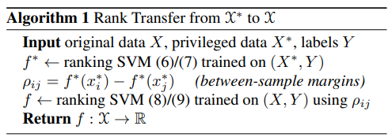

# Learning to Rank Using Privileged Information

学会用特权信息进行排序

# 摘要

​	  许多计算机视觉问题在训练和测试时具有不对称的信息分布。在这项工作中，我们研究在训练时有关于训练数据的附加信息的情况，但这些信息在测试时将不可用。这种情况称为使用特权信息的学习 (Learning Using Privileged Information，LUPI)。 我们介绍了两种能够利用这种额外信息源的最大间隔 (maximum-margin)技术，并且我们表明该框架适用于之前在计算机视觉中研究过的几种场景。 将属性、边界框、图像标签和基本原理作为对象分类中的附加信息的实验显示出很有前景的结果。

## 介绍

​	  在这项工作中，我们研究了使用特权信息 (LUPI) 学习的问题，它是由 Vapnik 在 [25] 中正式引入的。使用特权信息学习意味着对于学习任务，例如目标分类，不仅可以访问我们想要学习的任务的输入/输出训练对，还可以访问有关训练示例的其他信息。通常与单独的训练数据相比，这些额外数据比手头任务的信息量更大，因此人们希望使用它来进行更好的预测。但是，目前尚不清楚如何执行此操作，因为在测试时将没有此类数据源。一个可能的类比是人类与老师的学习：当学生在学校学习一个概念时，例如代数，老师可以随时提供额外的解释。 这将使学生学得比老师只提出问题并给出答案更快。然而，当学生在以后的生活中遇到代数问题时，将无法再依赖老师的专业知识。

​	  在这项工作中，我们证明了这种观察在各种计算机视觉场景中的相关性：我们在目标分类的上下文中探索了四种不同类型的特权信息：描述目标语义属性的属性，而不仅仅是视觉属性，指定目标对象在图像中的精确定位的边界框、以文本形式描述图像上下文的图像标签 (tags)，以及提供额外信息的注释者的理由（为什么训练示例被这样注释）。

​	  图 1 说明了这四种模式。所有这些之前都在计算机视觉文献中研究过，请参阅我们在第 2 节中的讨论。然而，在每种情况下，都设计了一种单独的方法来处理特定的附加信息源。我们在这项工作中的贡献之一是表明可以在一个统一的框架——LUPI中处理所有这些情况。

​	  **方法和贡献**：乍一看，并不清楚在测试时不可用的数据模态如何对分类有什么：例如，在特权数据上训练分类器是无用的，因为无法在测试数据上评估生成的分类器。因此，LUPI 需要一个额外步骤：从特权到原始数据模态的信息迁移。

​	  本文中工作的核心有一个观点：特权信息使我们能够区分训练集中的简单示例和困难示例。假设特权数据与原始数据具有相似的关于手头问题的信息，我们可以假设，**对于特权信息来说容易或难的例子对于原始信息来说也是容易或困难的**。 因此，我们获得了关于学习问题的额外知识，这可以指导基于图像的预测器的训练以获得更好的解决方案。

​	  我们在第 3 节中将上述观察形式化，其中我们还介绍了 LUPI 的两种最大间隔学习技术。 第一个，SVM+，在分类设置中起作用，最初由 Vapnik [25] 描述。第二个，排名迁移，是一个新的贡献，其目标是排序设定。在第 4 节中，我们报告了前面介绍的四种特权信息场景中的实验，并在第 5 节中得出结论。

## 相关工作

略

## 使用特权信息的学习

​	  我们假设有监督的二元分类的情况：给定一组 N 个训练示例，由特征向量 X = {x1,...,xN } ⊂ X ⊂ Rd 和它们的标签注释 Y = {y1,..,yN } ∈ Y = {+1, −1}，任务是从可能函数的空间 F 中学习预测函数 f : X → R，例如所有线性分类器。在下文中，我们以图像为例，并将它们的表示视为根据图像内容计算得出，例如视觉词袋直方图 [6]。

​	  采用 LUPI 设置，我们获得了关于训练集的额外信息，我们假设这些信息也是特征向量的形式，X∗ = {x∗ 1,...,x∗ N } ⊂ X∗ ⊂  Rd∗ ，其中任何 x∗ i 都对我们拥有的关于 xi 的附加信息进行编码。 请注意，我们不会对这些特权数据做进一步的假设。 特别是，x∗ i 可能无法从原始图像中计算出来，而是反映了一种非常不同的信息，例如人类老师提供的解释。 此外，通常 X∗ 将与 X 不同，因此不可能将 X 上定义的函数应用于 X∗ ，反之亦然。

​	  LUPI 的目标是使用特权数据 X* 来学习一个优于没有用LUPI的分类器。然而，很明显 f : X → R 本身不能依赖于 X∗ 域，因为这在测试时不可用。 因此，必须是我们自己对 f ∈ F 进行选择（受特权数据影响）

​	  在这份手稿中，我们依赖一个直觉：特权数据帮助我们区分训练集中的简单示例和困难示例。 这些知识使我们能够识别训练数据的相关方面，并将学习步骤集中在这些方面，从而找到具有更高预测质量的函数

​	  在下文中，我们解释了两种最大边际方法，用于使用符合这种解释的特权信息进行学习。为简单起见，我们以原始形式写出所有问题。 使用标准技术可以对它们进行内核化和二元化 [21]

### SVM+

​	  Vapnik 等人提出了第一个使用特权信息学习的模型 SVM+[17, 25]。 它基于这样一个观点，即如果可以访问松弛的预言机 (slack oracle)，则训练支持向量机 (SVM) 会更容易。一般SVM 训练基于以下约束目标函数：

​	  通过最小化分类器参数 w, b 和松弛变量 ξ1,...,ξN ，我们得到 SVM 的解。当训练示例的数量增加时，已知会以 $1/\sqrt N$ 的速率收敛到最佳分类器 [24]。 然而，如果我们事先知道最优松弛值 ξi，例如从预言机中，针对 w 和 b 执行优化，那么收敛速度会提高到 1/N [25]。 因此，与普通 SVM 相比，这种 OracleSVM 只需更少的训练样本就能达到一定的预测精度。

​	  SVM+ 分类器的思想是使用特权信息作为预言机的代理。 为此，我们用未知的 w∗ 和 b∗ 参数化 ξi = w∗, x∗ i + b∗，得到 SVM+ 训练问题：

​	  对此的直观解释是松弛变量告诉我们哪些训练样本容易，哪些很难。在 OracleSVM 中，训练过程不必从数据中推断出来，可以使用训练示例中包含的所有统计信息来找到实际感兴趣的目标：分类超平面。

### 排序迁移

​	  为了克服 SVM+设置的局限性，我们引入了在这项工作中利用特权信息的第二种方法。同样，基本思想是识别简单和困难的案例。然而，我们没有使用特权数据来识别易于分类和难以分类的示例，而是采用排序设置并识别易于分离和难以分离的示例对。

​	  我们的公式基于学习排序框架[12]，这需要解决以下优化问题

。。。

​	  上述公式强制要求不同类别标签的任何一对示例之间的排名分数差异至少为 1。 然而，直觉上很明显，一些示例对将比其他示例更容易分离。某些示例对甚至可能无法在给定的数据表示中正确排名。 遵循与上述相同的直觉，我们假设先验地知道哪些示例对容易分离，哪些很难分离，并且在学习过程中考虑到这一点应该可以提高预测性能。

​	  这种考虑将我们引向算法 1 中总结的 Rank Transfer 方法。我们首先在 X* 上训练一个普通的排序 SVM。 由此产生的排序函数 f ∗ ，我们用来计算任何两个训练图像之间实现的边距 ρij := f ∗(x∗ i ) − f ∗(x∗ j )。 可以认为具有较大 ρij 值的示例对很容易分离，而 ρij 的小值甚至负值表示很难或甚至不可能分离。 然后我们在 X 上训练一个排序 SVM，目的是在任何两个示例 xi 和 xj 之间建立一个依赖于数据的边距 ρij，而不是在所有对之间强制执行恒定的边距 1。对应的优化问题为

​	  可以看到，与普通排序 SVM 相比，具有较小 ρij 值的示例对对 w 的影响更有限。 甚至完全忽略排名不正确的对。我们的解释是，如果不可能在特权空间中正确地对某一对进行排序，那么在可推测地 (presumably)更弱原始空间中也不可能这样做。
强制优化以解决无望的任务只会导致过度拟合和降低排名准确性。

​	  **数值优化**。Rank Transfer 方法中的两个学习步骤，在 X∗ 和 X 上的排名，都是凸优化问题。 此外，与 SVM+相比，我们可以使用标准的 SVM 包来解决它们，包括在原始表示中起作用的有效方法 [4]，以及基于随机梯度下降的求解器 [22]。

​	  对于 X∗ 上的排序 SVM，这很明显，因为优化问题 (6)/(7) 与没有偏差项的二元 SVM 相同，在所有具有正标签的训练示例 xij 上进行训练。对于具有数据相关边距的排名，我们通过重新参数化来实现相同的目标：我们将每个约束 (9) 除以相应的 ρij ，这是可能的，因为只有 ρij > 0 的对才会出现。将变量从 xij 更改为 xˆij = xij/ρij 并从 ξij 更改为 ˆξij = ξij/ρij 我们得到等效优化问题

