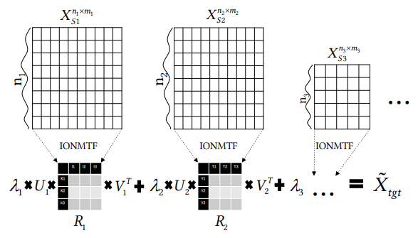

# Robust Transfer Learning for Cross-domain Collaborative  Filtering Using Multiple Rating Patterns Approximation

## 摘要

协同过滤技术是构建推荐的常用方法，并已广泛应用于实际推荐系统中。然而，由于用户-物品交互的稀疏性，协同过滤通常会受到性能限制。为了解决这个问题，通常使用辅助信息来提高性能。迁移学习提供了使用来自辅助领域的知识的关键思想。协同过滤中迁移学习的假设是源域是一个完整的评分矩阵，这在许多实际应用中可能不成立。在本文中，我们研究了如何利用来自多个不完整源域的评分模式来提高推荐系统的质量。首先，通过迁移学习，我们将源域中的知识压缩到cluster-level的评分矩阵中。低级矩阵中的评分模式可以迁移到目标域。具体来说，我们设计了一种知识提取方法，通过放宽对源域的完整评分限制来丰富评分模式。最后，我们为跨域协同过滤提出了一种稳健的多评分模式 (multiple-rating-pattern) 迁移学习模型 MINDTL，以准确预测目标域中的缺失值。对真实世界数据集的大量实验表明，我们提出的方法是有效的，并且优于几种替代方法。

## 1 介绍

推荐系统通过识别可能与每个用户的口味或偏好相匹配的特定物品来帮助用户面对大量的物品选择。人们越来越多地转向推荐系统来帮助他们找到对他们最有价值的信息。推荐系统研究和实践中最成功的技术之一是协同过滤。

协同过滤收集用户评分，并根据用户与其他用户的相似性预测用户将对其进行评分。
众所周知，协同过滤是最成功的推荐技术，并已在许多不同的应用中使用，例如推荐网页 [6, 23]、电影、文章 [31] 和产品。协同方法可以分为两种模型：基于邻域的模型 (NBM) [4, 24] 和潜在因子模型 (LFM) [16]。在 NBM 方法中，计算活跃用户与其他用户的相似度。活跃用户对某个物品的预测评分是所有相似用户对该物品的评分的加权平均值。LFM 方法将物品和用户转换到相同的潜在因子空间。根据因子（factor），潜在空间可以用来同时表征物品和用户。

潜在因子模型的一些最成功的实现是基于矩阵分解 (MF) [2, 5, 27, 28]。在基本的矩阵分解方法中，物品和用户都由从用户-物品评分矩阵中推断出的因子向量来表征。近年来，这些方法因其结果准确而变得流行。此外，它们为模拟各种实际应用程序提供了灵活的分解[17, 19]。最近，已经提出了几种基于 MF 的方法，包括最大边距矩阵分解 (MMMF) [15]、矩阵期望最大化 (EM) [26]、概率潜在语义分析 (PLSA) [29]、单纯体积 (volume) 最大化 (SiVM)  ) [3]、贝叶斯概率矩阵分解 (BPMF) [1] 和正则化非负矩阵分解 (RNMF) [32]。

低秩矩阵近似是一种有效的基于模型的协同过滤 (CF) 方法。通常，它从评分矩阵中导出一小组潜在因子，并在此潜在因子空间上表征用户和物品。使用用户和物品潜在因子向量的内积计算任何用户对任何物品的评分的预测。
然而，在现实世界的推荐系统中，用户可能只对很少量的物品进行评分。因此，评分矩阵通常非常稀疏。因此，可用于 K-NN 搜索、纯潜在因子模型、概率模型或矩阵分解的可用评分数据根本不够。稀疏问题已成为大多数 CF 方法的主要瓶颈。

为了缓解协同过滤中的稀疏性问题，一种有前景的方法是从相关领域的多个评分矩阵中收集评分数据，以进行知识转移和共享。跨域推荐问题已经在不同的研究领域从不同的角度得到解决。跨域协同过滤的目的是将评分模式从源域转换到目标域，以缓解目标域的稀疏性问题。基于码本的知识转移 (Codebook-based knowledge transfer, CBT) 是跨域协同过滤中广泛使用的模型 [12, 21, 22, 30]。在 CBT 中，码本是一个cluster-level的矩阵，其中包含从源域中提取的评分模式。

在早期的研究 [21, 22, 25] 中，ONMTF [8] 用于提取评分模式。ONMTF 假设源评分矩阵是完整的。然而，在实际情况下，所有可用的评分数据集都有空物品。事实上，这些数据集非常稀疏（有评分的物品少于 5%）。在跨域协同过滤中，为源域准备的原始数据矩阵应根据源评分矩阵的密度要求进行过滤。除此之外，源矩阵需要包含适当数量的具有充足评分模式的评分物品。我们学习从源获取评分模式矩阵（RPM）并使用 RPM 来近似目标矩阵。在现实世界中，很少有一个具有合适数量的评分物品的源。例如，MovieLens 最新数据集中有 700 位用户对 9000 部电影的 100,000 次评分。对于一个用户，评分数量最多为2391，最少为20。每个用户的评分电影和未评分电影的平均比例为143/8857。如果我们假设 100×100 矩阵（完整评分）中的 10,000 个评分（数据集中的 1/10）有足够的评分模式来构建有效的 RPM，并且每个用户-电影对都等概率地被评分或者未评分，那么通过数据过滤我们可以估计得到一个全评分的100×100 矩阵的概率。让 100 个用户对数据集中的相同的 100 部电影进行评分，我们得到的概率远小于 1%。这意味着我们从这个数据集中获得具有足够评分模式的完整评分矩阵的可能性很小。对于真实案例，影响评分密度的特征有很多，例如电影流行度和用户偏好，但在大多数真实世界数据集中仍然难以获得具有足够评分模式的完整评分矩阵。

本文的主要贡献总结如下

- 据我们所知，这是第一项应用不完整正交非负矩阵三分解 (IONMTF) 方法从源域中提取评分模式的工作。该方法放宽了对源域评分矩阵的全评分限制，并使评分模式矩阵与目标矩阵的近似更相关。
- 我们提出了一种用于跨域协同过滤的新颖、稳健、多评分模式迁移学习模型 MINDTL，可用于有效地跨域迁移评分模式，并克服欠拟合和过拟合问题。
- 基于五个真实世界的数据集，我们进行了大量实验来评估我们模型的有效性。结果表明，我们的模型明显优于baseline方法

本文的其余部分安排如下。在第 2 节中，我们展示了我们的模型。之后，我们在第 3 节中提供了优化公式和相关推论。第 4 节给出了算法和实现细节，第 5 节给出了实验结果和分析

## 2 方法

### 2.1 源评分模式的提取

我们专注于改进从源域中学习评分模式的过程，并提出了一种从源域中提取评分模式的创新方法。这种方法消除了以前的研究使用的全评分矩阵限制。因此，我们获得了更多可用于迁移学习的源数据集。当我们选择一个数据集作为源域时，在迁移学习之前需要对原始数据进行过滤。
我们将过滤过程称为数据预处理。图 1 和图 2 显示了相同的 10×10 玩具原始数据 (toy raw data) 矩阵中的数据预处理，其中包含 46 个评分项。之前的迁移学习要求对源域是完整评分的 (fully rated)。 2×5 过滤后的源矩阵中只有 10 个评分项。图 2 显示了玩具矩阵中没有完全评分限制的数据预处理。我们得到一个 4×7 过滤源矩阵，其中包含 22 个评分项和 6 个空条目。通过放宽源矩阵限制，原始数据集中的评分项利用率从 21% (10/46) 增加到 48% (22/46)，因此我们有一个更大的源矩阵，其中包含比以前更多的评分项。

图1 具有full rated限制的原始数据预处理

图2 没有有full rated限制的原始数据预处理

原始数据预处理后，我们得到源矩阵。在下一步中，我们需要从源矩阵中提取评分模式。在[22]中，评分模式矩阵称为码本，定义为 $k\times l$ 矩阵。码本从初始过滤的源矩阵中的 $k$ 个用户 clusters 和 $l$ 个物品clusters的 $n\times m$ 源矩阵中压缩cluster-level的用户物品。在图 3 中，左下和右侧中部中的 $X_{source}^{n \times m} $ 代表同一个源域矩阵。$X_{source}^{n \times m} $ 的行和列都被聚集在一个低级评分模式矩阵 $R^{k\times l}(RPM)$ 中。

图3 评分模式提取过程

我们将原始正交非负矩阵三分解（ONMTF）[8]扩展到不完全原始正交非负矩阵三分解（IONMTF）。ONMTF 算法已被证明等效于双向 K-means聚类算法 [8]，这也适用于 IONMTF。通过引入 IONMTF 算法，源域评分矩阵 $X_{source}$ 可以进行三因式分解如下：
$$
\min_{U \geq 0, V \geq 0, B \geq 0} 
\Big|\Big|M \circ (X_{source}-UBV^T) \Big| \Big|^2_F
\\ s.t. U^T U=I, V^T V=I
\tag1
$$
其中，$X_{source} \in R^{n\times m}_+, U \in R^{n\times l}_+, V \in R^{m\times l}_+, B \in R^{k \times l}_+$（ $R_+$ 表示非负实数域）。$U,V$都是非负的、正交的 。我们添加矩阵 $M$ 作为指示器 (indicator)，其中当 $X_{source_{ij}}\neq 0$ 时 $M_{ij}=1$，否则 $M_{ij}=0$ 。在(1)式 中，$\circ$ 运算符表示指示矩阵 $M$ 和原始 ONMTF 公式之间的 Hadamard 积运算。Hadamard 积确保仅根据现有项计算误差。

### 2.2 评分模式近似和目标域重建

从源域中提取评分模式后，我们可以使用这些模式来近似目标评分矩阵。在 CBT 模型中，通过将 $U_{tgt}$、评分模式矩阵 (RPM) 和  $V_{tgt}^T$ 相乘来进行近似。图 4 显示了 CBT 模型中的近似过程。来自目标域 $X_{tgt}$ 的用户 $u_1$ 属于来自源域的 RPM 中的用户cluster $k_2$，而物品 $v_2$ 属于评分模式中的物品cluser  $L_2$。因此，根据源域评分模式，用户 $u_1$ 对物品 $v_2$ 的缺失评分为 2。经过近似过程，可以填充 $X_{tgt}$ 中所有未知的评分，并将目标矩阵重建为 $\tilde X_{tgt}$  。

​			图4：将目标矩阵 $X_{tgt}$ 分解为用户成员 (membership) 矩阵 $U_{tgt}$ 和物品成员矩阵 $V_{tgt}$，并通过 $U_{tgt}$、$R$ 和 $V_{tgt}^T$ 的乘积重建 $\tilde X_{tgt}$ 

我们的模型 MINDTL 通过从多个不完整的源域中提取评分模式来解决 CBT 中的欠拟合问题。我们使用这些评分模式来近似和重建稀疏的目标矩阵，如图 5 所示。$X_{S_n}$ 表示不完整的源域矩阵。 MINDTL 使用 IONMTF 从 $X_{S_n}$ 中提取评分模式 $(R_n)$。$U_n$ 是指每个源 n 的 $p\times k_n$ 维的用户cluster成员。$V_n$ 指的是 $q\times l_n$ 维的物品cluster成员。 $U_n$ 和 $V_n$ 是二进制矩阵，其中“1”分别表示用户或物品在一个cluster中的成员资格。然后 MINDTL 线性组合多个评分模式近似来重建目标矩阵  $\tilde X_{tgt}$ 。MINDTL优化公式定义如下：

其中 $\lambda_n$ 是用于组合多个评分模式近似的线性乘数。$\lambda_n$ 也被视为 MINDTL 中多个源域之间的相关性值。$\lambda_n$ 被限制在 $[0,1]$ 内，因为现实世界中多个域之间的负关系并不常见。根据最大相关率100%，所有 $\lambda_n$ 的总和限制为1。

多评分模式近似

## 3 优化方法

### 3.1 非完整正交 Tri-Factor NMF

我们使用交替乘法更新算法[14]，该算法针对一组参数优化目标函数，同时固定其他参数，然后交替地交换参数集的角色。 这个过程将重复几次迭代直到收敛。 不完全正交非负矩阵三分解 (IONMTF) 损失函数在公式1中定义。遵循约束优化的标准理论，我们引入拉格朗日乘子 $\delta$（大小为 $U^TU$ 的对称矩阵）并最小化拉格朗日函数：
$$
L(U)=\Big|\Big|M \circ (X-UBV^T)\Big|\Big|^2_F +Tr(\delta(U^T-I))+Tr(\Phi U^T)
$$
注意，$\Big|\Big|(X-UBV^T)\Big|\Big|^2_F = Tr((X-UBV^T)^T(X-UBV^T))$，而且 $\Big|\Big|M \circ (X-UBV^T)\Big|\Big|^2_F$ 可以变形为：$Tr(M \circ (X^TX-2V^TX^TUB+U^TUBV^TVB^T))$ 

$L(U)$ 的梯度是：
$$
\frac{\delta L}{\delta U}= M \circ (-2VXB^T+2UBV^TVB^T)+2U\delta+\Phi
$$
其中，$\Phi$ 是 $U \geq 0$ 的非负拉格朗日约束。KKT互补条件 $\Phi_{ik}U_{ik}=0$ 给出：
$$
(\frac {\delta L} {\delta U})_{ik}=\sum_{ik}(M \circ (-2VXB^T+2UBV^TVB^T))_{ik}U_{ik}=0
$$
然后我们可以得到以下更新 $U_{ik}$ 的规则：
$$
U^{n+1}_{ik}=U^n_{ik}
\sqrt{\frac{V(M\circ X)B^T}{V(M\circ (UBV^T))B^T}}
\tag3
$$
学习 $B$：潜在因子 $B$ 可以通过类似的方式学习如下：
$$
B^{n+1}_{ik}=B^n_{ik}
\sqrt{\frac{U(M\circ X)V^T}{U^T(M\circ (UBV^T))V}}
\tag4
$$
学习 $V$：潜在因子 $V$ 可以通过类似的方式学习如下：
$$
V^{n+1}_{ik}=V^n_{ik}
\sqrt{\frac{U(M\circ X)B^T}{U^T(M\circ (UBV^T))B^T}}
\tag5
$$
我们可以通过基于上述学习不同潜在因子的更新规则的收敛性分析来证明学习算法是收敛的。 读者可参考 [7, 10] 了解更多详情。

### 3.2 线性乘子优化

我们仍然考虑每个用户/物品只能属于一个用户/物品clusters的情况。 我们可以交替更公式6中的 $U_n$ 和 $V_n$，这已被证明可以单调减少值并收敛到[22]中的局部最小值。
因此，对于每个源域，$U_{tgt_n}$ 和 $V_{tgt_n} $ 表示为 $U_n$ 和 $V_n$。用 F 表示的误差函数定义如下：
$$
F=\Big|\Big| \Big[X_{tgt}-\sum^N_{n=1}\lambda_n (U_n R_n V_n^T)  \Big]  \circ W \Big|\Big| ^2_F
\tag6
$$
我们的目标是找到在 $U_n$ 和 $V_n$ 固定的情况下使 $F$ 的 MSE 最小化的最佳 $\lambda_n$ 值。 为简单起见，我们使用符号 $M_n$ 作为 $(U_nB_nV_n^T)$ 和 $X$ 作为 $X_{tgt} \circ W$ 。 实际上，最小化 $F$ 的值等效于最小化 MSE，因此公式 6 可以改写如下：
$$
F=\sum_{i,j}(X-\sum^N_{n=1}\lambda_nM_n)^2_{ij}
\tag7
$$
我们通过随机梯度下降 (SGD) 学习相关系数 λn，这与 TALMUD [25] 中的最小二乘法 (LS) 不同。  SGD 可以更容易地控制 $\lambda_n$ 值的更新以符合公式2中的限制。另外，SGD避免了LS中的矩阵求逆计算，如果矩阵是奇异的，会导致错误。 此外，我们通过绕过矩阵求逆计算来降低计算复杂度。F 的梯度为：
$$
\frac{\delta F}{\delta \lambda_n}=
-2\sum_{i,j}(X-\lambda_nM_n)_{ij}(M_n)_{ij}=0
\tag8
$$
接下来我们可以通过以下方式迭代更新 $\lambda_n$：
$$
\lambda_n^{t+1} \leftarrow \lambda_n^t-
\frac{\delta L}{\delta \lambda_n^t} \times \theta
\tag9
$$
公式 9 中，我们可以根据经验将学习率系数 $\theta$ 设置为 0.1 到 0.01。 总之，我们通过每次迭代交替更新一组变量 $\{U_n, V_n, \lambda_n\}$，直到它们都收敛到局部最小值。

## 4 算法总览

我们使用 IONMTF 从多个源域中提取评分模式。算法 1 演示了该实现。MINDTL 中的评分模式近似和目标矩阵重建在算法 2 中实现。算法 1 和 2 均基于第 3 节中的优化公式。

### 算法1：评分模式近似

**输入：** 源矩阵的数量 $N$；$p_n \times q_n$ 源域评分矩阵 $X_{source}$； 用户和物品cluster的数量 $k_n$ 和 $l_n$； 自动重启次数 $Q$； 最大迭代次数 $T$。

**输出：**$k_n \times l_n$ 评分模式矩阵 $R_n$。

**实现细节**

因为优化公式：公式 3，公式 4 和公式 5 收敛到局部最小值，我们采用 Random-Restart Hill  Climbing (RRHC) 来避免不利的局部最小值。我们引入了一个计数器 $Q$ 并且每个 $U_n$ 和 $V_n$ 收敛 $Q$ 次。$Q$ 的值根据经验设置为 100。随着每次循环，公式 2 中的 $U_n,V_n,R_n$ 以不同的方式初始化，以便它们收敛到不同的局部最小值。经过 Q 次迭代，我们得到 $Q$ 个局部最小值。我们选择这些最小值中的最小值 (the smallest value of the minimums) 并相应地设置 $U_n,V_n,B_n$。

### 算法2：评分模式近似和目标矩阵重建

**输入：**评分模式矩阵的数量 $N$； $k_n×l_n$ 评分模式矩阵 $Rn$；目标评分矩阵 $X_{tgt}$；最大迭代记录 $T$。

**输出：**重建的目标矩阵 $\tilde X_{tgt}$ 。

**实现细节**

在算法2中，我们每次轮流求解三变量集合 $\{U_{tgt}, V_{tgt}, λ_n\}$，并迭代更新 $V_{tgt_n}^{(0)}$ 和 $U_{tgt_n}^{(0)}$。我们引入了一个临时相关性变量$\lambda_t$，并将 $\lambda$ 的新可用值暂时放入 $\lambda_t$ 。每一轮迭代，$\lambda_t$ 被更新，并且提前检查 $\lambda_t$ 的新值是否符合公式2中的限制。如果满足，我们将 $\lambda_n$ 更新为 $\lambda_t$，否则我们继续循环而不更新$\lambda_n$。

## 5 实验设置

在本节中，我们进行了实验，在几个真实世界的数据集上测试我们提出的方法。我们评估了

(1) 跨域推荐问题的性能，即使用多个域预测目标域中的缺失值

(2) 过拟合和欠拟合问题，即模型的预测性能可能较差。结果证明了我们方法的鲁棒性。

### 5.1 实验设置

为了测试我们的工作性能，我们进行了两组独立的实验：

1. 在第一个实验中，我们使用 Netflix 和 EachMovie 数据集作为 $X_{source}$，使用 BookCrossing 和 MovieLens 数据集作为 $X_{tgt}$。我们还为我们的测试精心实现了一种数据预处理方法
   - 对于 ONMTF，我们首先从 Netflix 和 EachMovie 中分别选择了一个 80×80  和 30×30  完整评分矩阵来提取评分模式。
   - 对于 DC-ONMTF，我们首先使用用户评分的平均值分别填充上述不完整 Netflix 和 EachMovie 评分矩阵中缺失的评分。
   - 对于 IONMTF，我们分别从 Netflix 和 EachMovie 中选择了一个 394×400（ 稀疏性 95% ）和一个 500×500（的稀疏性 48%）的不完整评分矩阵来提取评分模式矩阵。
   - 这个实验是用 $X_{source}$ 和 $X_{tgt}$ 的四种不同组合来执行的。检查了 $X_{source}$ 和 $X_{tgt}$ 的每个组合（例如，我们使用 Netflix 作为$X_{source}$来提取评分模式，然后使用这些评分模式重建 BookCrossing ($X_{tgt}$) 评分矩阵）。使用此设置，我们可以创建多个场景来比较 ONMTF 和 IONMTF。评分模式矩阵维度 $k$ 和 $l$ 是根据 Li 等人[22]的方法设置的，他指出cluster模型应该足够紧凑以避免过拟合，但又要足够empressive以捕获重要的行为模式。我们设置 $k= p/10$, $l= q/10$ 并且 $X_{source}$ 是 $p ×q$ 维评分矩阵 。
2. 在第二个实验中，我们使用 Jester、Netflix 和 EachMovie 数据集作为 $X_{source}$，使用 MovieLens 和 BookCrossing 数据集作为 $X_{tgt}$。
3. 我们通过随机选择 80% 的评分进行训练，其余的用于目标域中的测试来进行坚持实验。

### 5.2 实验结果

在本节中，我们给出了将我们提出的方法应用于我们的数据集的实验结果。

如表 1 所示，在 ONMTF 方法中，对于评分模式矩阵 (RPM)，$X_{source}$ 的大小较小，这很可能是因为 ONMTF 的 $X_{source}$ 对完整评分矩阵有限制。与 DC-ONMTF 和 IONMTF 相比，ONMTF 的 $X_{source}$ 的评分物品也少得多。因此，ONMTF 的大小也比其他两种方法小得多。

表 2 和表 3 显示 ONMTF 的 RPM ($R$) 最小，MAE 和 RMSE 值最高，这意味着 ONMTF 的预测精度最低。这种表现不佳的可能原因是从源域转移的知识不足。请注意，IONMTF 具有与 DC-ONMTF 相同的 RPM ($R$) 大小，但具有最高的预测精度，这意味着我们的方法优于 ONMTF 和 DC-ONMTF。对于第二个问题，我们通过将迁移学习算法扩展到多个源域来执行我们提出的 MINDTL 方法

对于第二个问题，我们通过在多个源域上扩展迁移学习算法来执行我们提出的 MINDTL 方法。我们用仅一个源域或多个源域的组合来评估知识的可转移性，并将 MINDTL 的性能与 CBT 和 TALMUD 进行比较。首先，我们使用启发式相关性（HC）估计算法对可用源域 $X_{source}$ 从与目标域 $X_{tgt}$ 最相关的域到最不相关的域进行了启发式排序 [25]。启发式相关性越大，距离越大，$X_{source}$ 和  $X_{tgt}$ 之间的相关性越弱。因此，在启发式估计之后，可以通过增加启发式相关性将$X_{source}$分别添加到 TALMUD 和 MINDTL 模型中。

