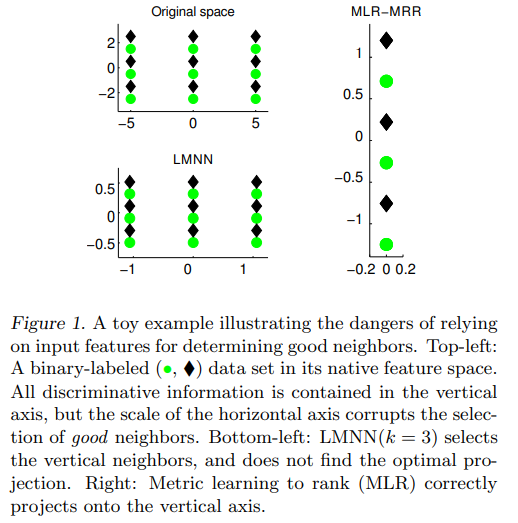
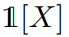
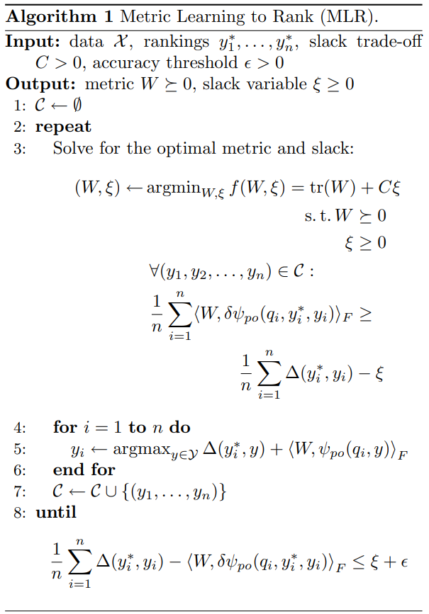

# Metric Learning to Rank

用度量学习排序

## 摘要

我们将度量学习作为信息检索问题来研究。我们提出了一种基于结构化 SVM 框架的通用度量学习算法来，来学习一个度量，以便可以针对各种排序度量（例如 AUC、Precision-at- $k$、MRR、MAP 或 NDCG）来优化由与查询 (query) 的距离引起的数据的排序。 我们展示了标准分类数据集和大规模在线约会推荐问题的实验结果。

## 1 介绍

在许多机器学习任务中，良好的性能取决于对象之间相似性的定义。尽管原始特征的欧几里得距离提供了一个简单且数学上方便的度量，但通常没有理由假设它对于手头的任务是最佳的。 因此，许多研究人员开发了算法来自动学习监督设置中的距离度量。

除了少数例外，这些度量学习算法都遵循同样的指导原则：一个点的好 neighbors 应该比坏 neighbors 更接近自己。 好的和坏的确切定义因问题的设置有所不同，但他们通常从 proximity 和 label agreement 的一些组合中获得。 在这一原则下，度量学习算法一般通过在测试集上 (held out data) 进行 k-NN 算法测试，用label的accuracy作为评估。

在高层次上，如果给定测试点 $q$ ，按与 $q$ 的距离升序对训练集进行排序，导致好neighbor $a$ 在列表的前面，而坏neighbor在末尾，我们认为度量是好的。从这个角度来看，我们可以将最近邻预测作为排序问题，并将预测的标签错误率作为排序的损失函数。因此，从本质上讲，度量学习问题是 *query by example* 范式中信息检索的特例。

近年来，排序学习算法的开发取得了许多进展（Joachims, 2005; Burges et al., 2005; Xu & Li, 2007; Volkovs & Zemel, 2009）。与通常由度量学习解决的分类问题不同，排序问题通常缺乏单一的评估标准。 相反，已经提出了几种评估方法，每一种都包含不同的“正确性 (correctness) ”概念。 由于排序本质上是组合对象，因此这些评估指标在模型参数方面通常不可微分，因此难以通过学习算法进行优化。 尽管排序问题存在组合困难，但现在有几种算法技术可以优化各种排序评估方法(Joachims, 2005; Chakrabarti et al., 2008; Volkovs & Zemel, 2009)

在目前的工作中，我们试图减小度量学习和排序的差距。 通过采用来自信息检索的技术，我们推导出了一种通用度量学习算法，该算法针对真正感兴趣的数量 (true quantity of interest) 进行了优化：由学习到的度量中的距离引起的数据排列。

相反，对于许多信息检索应用，包括多媒体推荐，我们用距离度量来参数化排序函数是很自然的。

本方法基于结构化SVUM（Tsochantaridis et al.，2005），在一个统一的算法框架下很容易支持各种排序评估方法。将度量学习解释为一个信息检索问题，使我们能够将损失应用于排序级别，而不是pair-wise的距离，并且能够使用比以前的度量学习算法更 general 的相似性概念，包括非对称和不可传递的相关性定义。

### 1.1 相关工作

有大量的研究致力于设计在有监督的环境下学习最优度量的算法。通常，这些算法遵循一个通用方案：学习数据的线性投影（优选低秩），使得到预先决定的“好 neighbors ”集合的距离最小化，而“坏 neighbors ”距离最大化。

Xing等人（2003）将好邻域定义为所有 similarly-labeled 的点，并用半定规划求解度量。相似点对的距离由一个常数规定了上界，并最大化不相似点对的距离。该算法试图将每个类映射成一个固定半径的球，但不强制类之间的分离。

Weinberger等人（2006）将目标 neighbors 定义为原始特征空间中 $k$ 个最近的 similarly-labeled 的点，并强制目标 neighbors 和所有其他（不相似）点之间的距离为正。这放松了Xing等人（2003）的限制，即给定类的所有点必须彼此靠近，并且该算法在许多实际场景中表现良好。然而，如图1所示，依赖于原始特征空间来确定目标 neighbors 可能会使算法不适用于包含噪声或异构特征的问题域：一个有损 (corrupted) 特征可能主导初始距离的计算，并阻止算法找到最佳投影。

邻域成分分析（NCA）（Goldberger et al.，2005）通过在随机邻域选择规则下最大化正确检索点的期望数量来缓解问题。虽然这种松弛有直观的意义，但得到的优化是非凸的，它不能识别和优化学习空间中的前 $k$ 个最近邻。Globerson&Roweis（2006）优化了一个类似的随机邻域选择规则，同时试图将每个类collapse到一个点。这种思想在输出空间上比NCA具有更多的正则性，并导致了一个凸优化问题，但在实际中，整个类可以被collapse到不同的点的假设很少成立。

我们的方法的核心是基于结构化SVM框架（Tsochantaridis等人，2005）。我们在第2节中提供了一个简短的概述，并在第4节中讨论了ranking-specific的扩展。

### 1.2 准备工作

令 $X \subset {\mathbb R}^d，$ 表示训练集（语料库），且 $|X|=n$，$Y$ 表示 $X$ 的排列的集合。对于一个 query $q$ ，让 $X_q^+，X_q^-$分别表示训练集中相关的点和不相关的点的子集。对于排序 $y \in Y$ 和两个点 $x,y \in X$ ，用 $i \prec_y j(i \succ_y j)$ 表示在 $y$  中，$i$ 排在 $j$ 前面 。

$W \succeq 0，W \in {\mathbb R}^{d \times d}$ 表示一个对称的、半正定矩阵。对于 $i,j \in {\mathbb R}$ ，由 $W$ 定义的度量下的距离表示为： $||i-j||_W=\sqrt{(i-j)^T W(i-j)}$ 。对于矩阵 $A,B \in {\mathbb R}^{d \times d}$ ，将他们的Frobenius内积表示为 $\big < A,B\big >_F = {\rm tr}(A^TB)$ 。最后， 表示在 $X$ 上的 0-1 指示函数。

### 2 结构化SVM

结构化 SVM 可以被视为多分类 SVM（Crammer & Singer，2002）的泛化，其中可能的预测结果集合从label泛化到结构，例如 parse tree、排列、序列对齐等。（Tsochantaridis 等人，2005 ）。  Crammer & Singer (2002) 的多分类 SVM 公式在真实label $y^∗$ 和所有其他label $y$ 之间强制每个训练点 $q \in X$ 的边距：
$$
\forall y \neq y^*: w^T_{y^*}q \geq W^T_y +1 -\xi,
$$
其中 $\xi \geq 0$ 是一个松弛变量，用来允许训练集中的边界违规。类似地，结构化SVM在真实结构 $y^*$ 和所有其他可能的结构 $y$ 之间应用边距：
$$
\forall y \in Y, w^T \psi(q,y^*) \geq w^T \psi(q,y) + \Delta(y^*,y)-\xi.
\tag1
$$
这里，$\psi(q, y)$ 是向量值联合特征图，它表征输入 $q$ 和输出结构 $y$ 之间的关系。（此符号包含多分类 SVM 的class-specific的判别向量。）与类标签不同，两个不同的结构 $(y ∗ , y)$ 可能表现出相似的准确性，边际约束也应反映这一点。 为了支持更灵活的结构正确性的概念，将 margin 设置为 $\Delta(y^* , y)$ ：在结构之间定义的非负损失函数，通常以 [0, 1] 为值域。

对于多分类 SVM 中的测试query $\hat q$，预测label $y$ 是最大化 $w^T_y \hat q$ 的label，即与其他label相比具有最大边距的label。 类似地，结构预测是通过找到使 $w^T \psi (\hat q, y)$ 最大化的结构 $y$ 来进行的。 在计算输出结构 $y$ 时，预测算法必须能够有效地使用学习到的向量 $w$ 。正如我们将在第 2.2 节和第 3 节中看到的，这在一般排序中很容易实现，特别是在度量学习中。

### 2.1 优化

请注意，可能的输出结构的集合 $Y$ 通常非常大（例如，训练集的所有可能排列），因此在实践中强制执行 (1) 中的所有边际约束可能不可行。 然而，可以应用切割平面来有效地找到一个小的 active constraints 工作集，这些工作集足以在某些规定的 tolerance 内优化 $w$（Tsochan taridis 等，2005）。

切割平面方法的核心组件是分离预言机 (separation oracle) ，它给定一个固定的 $w$ 和输入点 $q$，输出 the structure $y$ corresponding to the margin constraint for $q$ which is most violated by $w$：
$$
y \leftarrow {\rm argmax}_{y \in Y} w^T \psi(q,y) + \Delta(y^*,y).
\tag2
$$
直观地说，这计算了结构 $y$，同时具有较大的损失 $\Delta(y^* , y)$ 和边际得分 $w^T \psi(q,y)$：简而言之，当前模型 $w$ 的缺点。通过关注constraints which are violated the most by the current model，为这些结构添加边距约束可以有效地将优化导向全局最优。

总之，为了将结构化 SVM 应用于学习问题，需要三件事：特征图 $\psi$ 的定义、损失函数 $\Delta$ 和用于分离预言机的有效算法。 这些过程当然都是高度相互依赖和domain-specific的。在下一节中，我们将描述在这种情况下解决排序问题的流行方法。

### 2.2 用结构化SVM排序

在排序的情况下，最常用的特征图是偏序特征（Joachims，2005）：
$$
\psi_{po}(q,y)=\sum_{i \in X^+_q} \sum_{j \in X^-_q} y_{ij}
(\frac{\phi(q,i)-\phi(q,j)}{|X^+_q|\cdot|X^-_q|})
\tag3
$$
其中
$$
y_{ij}=
\begin {cases}
+1 & i \prec_y j\\
-1 & i \succ_y j
\end {cases}
$$
​		且 $\phi(q, i)$ 是表征query $q$ 和点 $i$ 之间关系的特征图。直观地，对于每个相关-不相关对 $(i, j)$ ，如果 $i \prec_y j$，则添加差分向量 $\phi(q, i)−\phi(q, j)$ 否则减去。 从本质上讲，$\psi_{po}$ 强调特征空间中的方向，这些方向在某种意义上与正确的排序相关。 由于 $\psi$ 仅取决于 query 和单个点，而不是整个列表，因此它非常适合结合 domain-specific 的知识和特征。

​		已经有人为 $\psi_{po}$ 设计了分离预言机，并结合了各种排序评估方法（Joachims，2005；Yue 等，2007；Chakrabarti 等，2008），我们在第 4 节中给出了简要概述。

​		 $\psi_{po}$ 的一个诱人的特性是，对于固定的 $w$，最大化 $w^T \psi_{po}(\hat q, y)$ 的排序 $y$ 仅仅是对于 $i \in X$，按 $w^T\phi (\hat q, i) $ 降序排序。正如我们将在下一节中展示的，这个简单的预测规则可以很容易地用于基于距离的排序。

## 3 用度量学习来排序

如果query $q$ 与语料库 $X$ 位于同一空间，一种自然的排序是：按与 $q$ 的距离（的平方）升序来排序：$||q − i||^2 $。 由于我们的目标是学习最佳度量 $W$，因此在学习空间中计算距离并相应地排序：$||q − i||^2_W$ 。 该这一计算基于 Frobenius 内积的表达式如下：
$$
\begin {align}
||q − i||^2_W & =(q-i)^T W(q-i)={\rm tr}(W(q-i)(q-i)^T)\\
&=\big<W, (q-i)(q-i)^T   \big>_F
\end {align}
$$
其中第二个等式基于 trace 的循环性质。
这一观察提示了 $\phi$ 的一种自然的选择：
$$
\phi_M(q,i) \doteq -(q-i)(q-i)^T
\tag4
$$
（符号的变化保留了标准结构化 SVM 中使用的顺序。）因此，将语料库按 $||q − i||^2_W $ 升序排序等效于按 $\big< W,\phi_M(q,i)\big >_F$ 降序排序。 类似地，通过将 $\psi_M$ 与 $\psi_{po}$ 一起使用，使泛化的内积 $\big< W,\psi_{po}(q,y)\big>_F$ 最大化的排序 $y$ 恰好是 $X$ 在 $W$ 定义的度量下按与 $q$ 的距离升序的排序。

因此，通过将公式 1 和 2 中的向量积推广到 Frobenius 内积，我们可以推导出一种算法来学习一个度量，此度量针对 list-wise 的排序损失测量值进行优化。

### 3.1 算法

理想情况下，我们希望求解最佳度量 $W^*$，它可以最大化每个query的所有可能排序的边际 (margin) 。然而，由于  $|Y|$  是训练集大小的超指数 (super exponential)，使用当前技术不可能实现精确的优化过程。相反，我们通过使用切割平面算法来近似完全优化。

具体来说，我们用于学习 $W$ 的算法改编自 Joachims 等人(2009)的 1-Slack 边际再缩放切割平面 ( 1-Slack margin-rescaling cutting-plane) 算法。 在高层次上，算法交替地优化模型参数（在我们的例子中为 $W$）和用新的一批排序$（y_1,y_2,...,y_n)$ 更新约束（每个点一个排序）。 一旦新约束批次上的经验损失在前一组约束上的损失的规定tolerance $\epsilon>0$ 范围内，算法就会终止。

1-Slack 方法与其他类似的切割平面技术之间的主要区别在于，不是为每个 $q \in X$ 维护一个松弛变量 $ξ_q$，而是在所有约束批次之间共享一个单一的松弛变量 $ξ$，所有约束批次依次通过平均训练集中的每个点来aggregate。

我们引入了两个修改来使原始算法适应度量学习。 首先，$W$ 必须被限制为半正定以定义有效的度量。其次，我们将标准的二次 (quadratic) 正则化 $\frac{1}{2}w^Tw$ （或  $\frac{1}{2}{\rm tr}(W^T W)$ ）替换为 ${\rm tr}(W)$。直观地说，这将 $W$ 的特征值的 $l_2$ penalty交换为 $l_1$ penalty，从而促进了对稀疏性和低秩的解决。

一般的优化过程被列为算法 1。 为了紧凑，我们定义
$$
\delta \psi_{po}(q,y^*,y)=\psi_{po}(q,y^*)-\psi_{po}(q,y)
$$

### 3.2 实现

为了解决算法 1 中的优化问题，我们在 MATLAB 中实现了梯度下降求解器。在每个梯度步骤之后，更新后的 $W$ 通过谱分解（特征分解）被投影回可行的 PSD 矩阵集

尽管算法中使用了很多特征向量（$\delta \psi_{po}$），但有效的 book-keeping 使我们能够减少梯度计算的开销。请注意，可以将 $\xi$ 解释为集合 $\{ξ1,ξ2,...\}$的 point-wise 最大值。其中 $ξ_i$ 对应于第 $i$ 个批次的边际约束。
因此，在 $\xi > 0$ 的任何时候，目标 $f(W, \xi)$ 的梯度可以用实现当前最大边界违规的单个批次 $(\hat y1, ..., \hat yn)$ 表示：
$$
\frac{\partial f}{\partial W}= I-
\frac{C}{n}  \sum_{i=1}^n
\delta \psi_{po}(q_i,y_i^*,\hat y_i)
$$
请注意， $\psi_{po}$ 仅以约束批次的平均值的形式出现在算法 1 中。 这表明对于每个批次，而不是每个点的单独矩阵，只维护一个 $d\times d$ 矩阵就足够了
$$
\Psi = \frac{1}{n} \sum_{i=1}^n
\delta \psi_{po}(q_i, y^*_i, y_i)
$$
因为 $\phi_M$ 来自数据的外积，所以每个  $\psi_{po}(q,y)$  可以被分解为
$$
\psi_{po}(q,y)=XS(q,y)X^T
$$
其中 $X$ 的列包含数据，$S(q,y)$ 是一个对称的 $n × n$ 矩阵，其中：
$$
S(q,y)=\sum_{i \in X^+_q} \sum_{j \in X^-_q}y_{ij}
\frac{(A_{qi}-A_{qj})}{|X^+_q| \cdot |X^-_q|}
\tag5 \\
A_{qx}=-(e_q-e_x)(e_q-e_x)^T
$$
$e_i$ 是 ${\mathbb R}^n$ 中的第 $i$ 个标准基向量。通过线性，这种因式分解也可以用于 $δ\psi_{po}(q,y^*,y)$ 和 $\Psi$。

通过计算具有正号和负号的 $A_{qx}$ 的出现次数并收集这些项，可以更直接地计算公式 5 中的和。 这可以通过单次遍历 $y$ 在线性时间内完成。

通过以因式分解形式表示 $\Psi$ ，我们可以将所有矩阵乘法延迟到最终的 $\Psi$ 计算。 由于可以直接构造 $S(q, y)$ 而无需显式构建外积矩阵 $A_{qi}$，我们将每次梯度计算的矩阵乘法次数从 O(n) 减少到 2。

## 4 排序方法

在这里，我们简要概述了流行的信息检索评估标准，以及如何将它们纳入学习算法。

回顾一下，分离预言机（公式 2）寻求排序 $y$，它使判别分数 $\big< W,\psi_{po}(q,y)\big>_F$ 和排序损失 $\Delta(y^*,y)$ 之和最大化。
我们考虑的评估标准所共有的一个属性是相关（或不相关）集合内排列的不变性 (invariance)。正如之前所观察到的，对 $y$ 的优化简化为找到相关和不相关集合的最佳交织，每个集合都已通过 point-wise 判别分数 $\big< W,\phi_{M}(q,i)\big>_F$ 预先排序 （Yue 等人，2007 年）。

由于这里讨论的所有方法都取 [0, 1] 中的值（1 是完美排名的分数），我们考虑以下形式的损失函数
$$
\Delta(y^*,y)={\rm Score}(y^*)-{\rm Score}(y)=1-{\rm Score}(y)
$$

