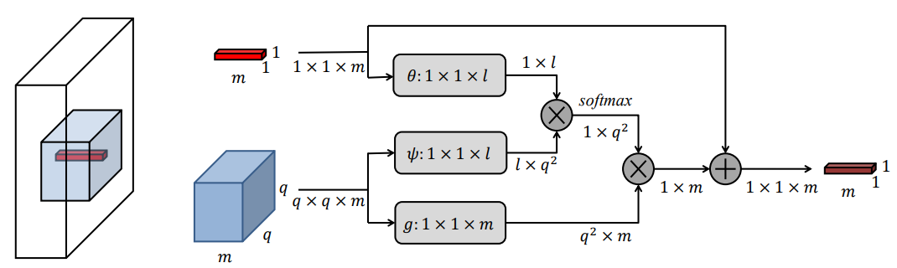
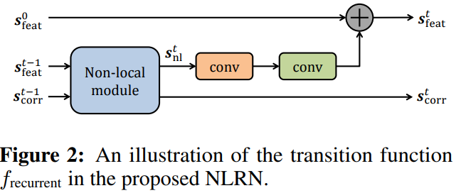
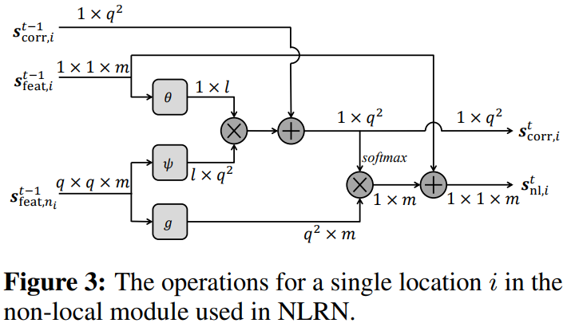
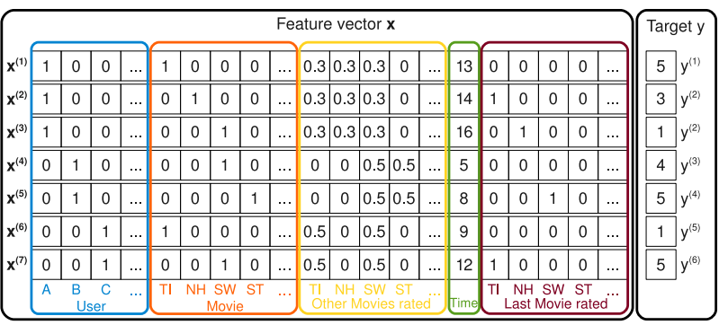

# Non-Local Recurrent Network for Image Restoration

用于图像恢复的非局部循环网络NLRN

# 摘要

​	  目前许多经典的方法已经证明了自然图片的非局部自相似度(non-local self-similarity)可以作为图像重建任务中一个有效的先验知识。然而让深层神经网络合理的利用这一图片固有属性仍旧是一个挑战性任务。这篇论文中作者提出了非局部循环网络(non-local recurrent network,NLRN)，完成图像恢复任务，主要贡献如下：

- 将非局部模块可以灵活地集成到神经网络中进行端到端的训练，以捕捉捕获每个位置与其邻域之间的深度特征相关性。（现有方法以孤立方式测量自相似度）
- 使用循环神经网络框架(RNN)较好的提高了参数的利用率，并允许沿着相邻的循环状态传播深度特征相关性，且较好的提高了由于图像严重退化造成的不准确相关性估计的鲁棒性
- 证明了计算特征相似度时，限制相邻特征的范围对图像修复任务十分重要

对图像去噪和超分辨率任务进行了广泛的实验。由于循环的非局部运算和相关性传播，所提出的 NLRN 以更少的参数获得了优于SOTA的结果。

## 介绍

​	  图像恢复是一个不适定的逆问题，旨在从退化的测量中估计潜在图像 (underlying image)。根据退化的类型，图像恢复可以分为不同的子问题，例如图像去噪和图像超分辨率 (super-resolution, SR)。成功恢复的关键通常依赖于基于图像先验的有效正则化器 (regularizer)的设计。在过去，局部和非局部图像先验都被广泛利用。以图像去噪为例，局部图像特性，如高斯滤波和基于total variations的方法 [32] 在早期研究中被广泛使用。后来，自然图像中自相似度的概念引起了更多的关注，且已被用于基于非局部的方法，例如，非局部均值 [2]、协同过滤 [8]、联合稀疏性 [28] 和低秩（low rank）建模 [16]。这些非局部方法被证明可以有效地捕获非局部patches之间的相关性以提高恢复质量。

​	  虽然文献中已经广泛研究了非局部自相似度，但用深度网络捕获这种内在属性的方法的探索很少。最近用于图像恢复的卷积神经网络 (CNN) [10, 21, 29, 51] 比传统方法取得了令人印象深刻的性能，但没有明确使用图像中的自相似性。为了弥补这个弱点，一些研究 [24, 31] 在将patches输入 CNN 之前将块匹配 (block matching)应用于patches。然而，块匹配步骤是孤立的，因此不会与图像恢复网络联合训练。

​	  在本文中，我们首次尝试在 CNN 中结合非局部运算进行图像恢复，并提出非局部循环网络 (NLRN) 作为具有非局部模块的高效网络。

- 首先，我们设计了一个非局部模块，在图像严重退化的情况下，为自相似度的测量产生可靠的特征相关性，模块可以灵活地集成到现有的深度网络中，同时享受端到端学习的好处。为了在不影响恢复质量的情况下获得较高的参数效率(parameter efficiency)，我们部署了类似于 [22, 37, 38] 的循环神经网络 (RNN) 框架，以便递归地应用具有共享权重的运算。
- 其次，我们仔细研究了深度特征空间中非局部运算的行为，发现限制相关性计算的邻域提高了其对退化图像的鲁棒性。受限的邻域有助于将计算集中在空间附近的相关特征上，而且忽略噪声特征，这符合传统的图像恢复方法 [8, 16]。
- 此外，我们允许在 RNN 的相邻循环状态之间进行非局部运算的消息传递。
  这种特征相关性的inter-state流促进了更鲁棒的相关性估计。

通过将非局部运算与典型卷积相结合，我们的 NLRN 可以有效地捕获并利用局部和非局部图像属性图像用于图像恢复。

​	  值得注意的是，最近的工作在视频分类上采用了类似的思想 [43]。然而，我们的方法在以下方面与它有很大不同。

- 对于每个位置，我们仅在其邻域内测量每个位置的特征相关性，而不是像 [43] 中那样在整个图像中进行测量。在我们的实验中，我们证明对计算非局部先验有用的深层特征更有可能位于相邻区域。较大的邻域（一个极端是整个图像）可能导致对退化测量的相关估计不准确。
- 而且，我们的方法充分利用了 RNN 架构的优势——相关性信息在相邻的循环状态之间传播，以增加相关性估计对不同程度退化的鲁棒性。
- 此外，我们的非局部模块可以灵活地处理各种大小的输入，而 [43] 中的模块仅处理固定大小的输入。

​	  我们通过首先将我们提出的模型与统一框架中的其他现有的经典非局部图像恢复方法相关联来引入 NLRN。我们通过大量的消融研究彻底分析了 NLRN 中的非局部模块和循环架构。我们与最近的竞争对手进行了全面比较，其中我们的NLRN 在多个基准数据集上实现了SOTA的图像去噪和 SR 性能，证明了具有循环架构的非局部运算在图像恢复方面的优越性。

## 相关工作

​	  图像自相似性作为重要的图像特征已被用于许多基于非局部的图像恢复方法。 早期的工作包括用于图像去噪的双边滤波 [40] 和非局部方法 [2]。 最近的方法通过施加稀疏性来利用图像自相似性 [28, 46]。 或者，类似的图像块用低秩 [16] 或通过协同维纳过滤 [8, 49] 建模。 邻域嵌入是图像 SR [5, 39] 的常用方法，其中每个图像块由流形中的多个相似块近似。基于自我示例的图像 SR 方法 [15, 13] 利用局部自相似性假设，仅从不同尺度的低分辨率图像中提取 LR-HR 示例对以预测高分辨率图像。 类似的想法被用于图像去模糊 [9]。

​	  深度神经网络已普遍用于图像恢复。开创性的工作包括用于图像去噪的多层感知器 [3] 和用于图像 SR [10] 的三层 CNN。 采用解卷积来节省计算成本并加快推理速度[36, 11]。 非常深的 CNN 旨在提高 [21, 23, 25] 中的 SR 准确性。 各种残差块之间的密集连接包含在 [41] 中。 类似地，在 [29, 51, 52, 27] 中开发了基于 CNN 的方法用于图像去噪。作为预处理步骤的块匹配与用于图像去噪的 CNN 级联 [24, 31]。除了 CNN，RNN 也被应用于图像恢复，同时享有高参数效率 [22, 37, 38]。

​	  除了图像恢复之外，特征相关性与神经网络一起在许多其他领域被广泛利用，包括图形模型 [53, 4, 18]、关系推理 [33]、机器翻译 [14, 42] 等。 限于篇幅，我们在此不再详述。

## 用于图像恢复的非局部运算

​	  在本节中，我们首先提出了用于图像恢复方法的非局部操作的统一框架，例如协同过滤 [8]、非局部均值 [2] 和低秩建模 [16]，并且讨论了他们之间的关系。
然后我们提出了非局部运算模块。

### 一个统一框架

​	  通常，非局部运算以多通道输入 ${\boldsymbol X} ∈ {\mathbb R} ^{N\times m} $ 作为图像特征，并生成输出特征  ${\boldsymbol Z} ∈ {\mathbb R} ^{N\times  k} $ 。这里 $N$ 和 $m$ 分别表示图像像素数和数据通道数。我们提出了一个具有以下公式的通用框架：
$$
{\boldsymbol Z} ={\rm diag}\{ \delta({\boldsymbol X}) \}^{-1}\Phi({\boldsymbol X})G({\boldsymbol X}) \tag1
$$
其中 $\Phi({\boldsymbol X}) \in {\mathbb R}^{N \times N}$ 是非局部相关性矩阵， $G({\boldsymbol X}) \in {\mathbb R}^{N \times k}$ 是多通道非局部变换（transform）。每个行向量 ${\boldsymbol X}_i$ 代表在位置 $i$ 的局部特征。$\Phi({\boldsymbol X})^j_i$ 表示 ${\boldsymbol X}_i$ 和 ${\boldsymbol X}_j$ 之间的关系，且每个行向量 $G({\boldsymbol X})_j$ 是 ${\boldsymbol X}_j$ 的embedding。对角矩阵 ${\rm diag}\{ \delta({\boldsymbol X}) \} \in {\mathbb R} ^{N \times N}$ 使用归一化因子 $\delta_i({\boldsymbol X})$  对每个第 $ i $ 个像素的输出进行归一化。 

### 经典方法

​	  所提出的框架适用于各种经典的非局部图像恢复方法，包括基于低秩 [16]、协同过滤 [8]、联合稀疏性 [28] 以及非局部均值过滤 [2] 的方法。

​	  块匹配 (BM) 是传统方法中利用非局部图像结构的常用方法 [16, 8, 28]。
一个 $q × q$ 空间邻域被设置为以每个位置 $i$ 为中心，${\boldsymbol X}_i$ 减少到以 i 为中心的图像patch。 BM 从该邻域中选择 $K_i$ 最相似的patches（$K_i \ll q^2$），它们共同用于恢复 ${\boldsymbol X}_i$ 。在此非局部框架下，这些方法可以表示为
$$
{\boldsymbol Z}_i=\frac{1}{\delta_i({\boldsymbol X})}
\sum_{j \in {\mathbb C}_i}
\Phi({\boldsymbol X})_i^j  G({\boldsymbol X})_j, \forall i
\tag 2
$$
其中， $\delta_i({\boldsymbol X})= \sum _{j \in {\mathbb C}_i} \Phi({\boldsymbol X})_i^j$ ， ${\mathbb C}_i$ 代表所选的 $K_i$ 个patch的索引的集合。因此每行 $\Phi({\boldsymbol X})_i$ 都只有 $K_i$ 个非零条目。embedding $G({\boldsymbol X})$ 和非零元素因基于不同模型的非局部方法而异。例如，在WNNM[16]中，$\sum_{j \in {\mathbb C}_i}
\Phi({\boldsymbol X})_i^j  G({\boldsymbol X})_j$ 对应 ${\boldsymbol X}_i$ 在特定组（group-space）子空间上的投影，作为所选patches的函数。具体来说，用于计算 ${\boldsymbol Z}_i$ 的子空间由 ${\boldsymbol X}^T_{{\mathbb C}_i}{\boldsymbol X}_{{\mathbb C}_i}$ 的特征向量 (eigenvector) $U_i $跨越 (span)。因此 ${\boldsymbol Z}_i={\boldsymbol X}_{{\mathbb C}_i} U_i {\rm diag}\{ \sigma\} U_i^T$，其中 $\rm diag\{σ\}$ 是通过将与加权核范数 (weighted nuclear norm)[16]相关的收缩函数应用于 ${\boldsymbol X}^T_{{\mathbb C}_i}{\boldsymbol X}_{{\mathbb C}_i}$  的特征值 (eigenvalues)来获得的。我们在第 7 节中展示了关于更经典的非局部图像恢复方法的概括。

​	  除了硬 (hard) 块匹配之外，其他方法，例如非局部均值算法[2]，通过计算参考patch与邻域中每个patch之间的相关性来应用软 (soft) 块匹配。每个元素 $\Phi({\boldsymbol X})_i^j$ 都只由每个 $\{{\boldsymbol X}_i, {\boldsymbol X}_j\}$ 对决定。因此 $\Phi({\boldsymbol X})_i^j= \phi(\{{\boldsymbol X}_i, {\boldsymbol X}_j\})$ ，其中 $\phi(·)$ 由所选的距离度量准则确定。在[2]中，使用带高斯核的加权欧式距离作为度量，即：$\phi({\boldsymbol X}_i, {\boldsymbol X}_j)=\exp\{-||{\boldsymbol X}_i-{\boldsymbol X}_j||^2_{2,a}/h^2\}$ 。此外，身份映射直接用作 [2] 中的embeddings，即 $G({\boldsymbol X})_j = {\boldsymbol X}_j $。在这种情况下，（1）中的非局部框架简化为
$$
{\boldsymbol Z}_i=\frac{1}{\delta_i({\boldsymbol X})}
\sum_{j \in {\mathbb S}_i}
\exp \{-\frac{||{\boldsymbol X}_i-{\boldsymbol X}_j||^2_{2,a}}{h^2}\} {\boldsymbol X}_j, \forall i
\tag 3
$$
其中， $\delta_i({\boldsymbol X})=\sum_{j \in {\mathbb S}_i} \exp\{-||{\boldsymbol X}_i-{\boldsymbol X}_j||^2_{2,a}/h^2\}$ ，${\mathbb S}_i$ 是  ${\boldsymbol X}_i$ 邻域的索引的集合。请注意，$a$ 和 $h$ 都是常数，分别表示高斯核的标准差和滤波程度 (degree of filtering) [2]。值得注意的是，软 BM 的 ${\mathbb S}_i$ 的基数 (cardinality)远大于硬 BM 的 ${\mathbb C}_i$ 的基数，这为使用相邻位置之间的特征相关性提供了更大的灵活性。

​	  传统的非局部方法的缺点是参数要么是固定的 [2]，要么是通过次优方法获得的 [8, 28, 16]，例如，WNNM 的参数是基于低秩假设学习的，这是次优的，因为最终目标是最小化图像重建误差。

### 非局部模块

​	  基于（1）中的通用非局部框架，我们提出了另一种软块匹配方法，并应用线性embeddings的高斯核的欧式距离[43] 作为距离度量。线性embeddings定义如下：
$$
\Phi({\boldsymbol X})_i^j=\phi({\boldsymbol X}_i, {\boldsymbol X}_j)
=exp\{\theta({\boldsymbol X}_i)\psi({\boldsymbol X}_j)^T\},  \forall i,j
\tag4
$$

$$
\tag5
\theta({\boldsymbol X}_i)={\boldsymbol X}_i W_{\theta},
\psi({\boldsymbol X}_i)={\boldsymbol X}_i W_{\psi},
G({\boldsymbol X})_i={\boldsymbol X}_i W_g, \forall i
$$

embedding变换 $W_θ、W_{\phi} $和 $W_g$ 都是可学习的，并且分别具有 $m × l,m ×l,m × m$ 的形状。因此，提出的非局部运算可以写为
$$
{\boldsymbol Z}_i=\frac{1}{\delta_i({\boldsymbol X})}
\sum_{j \in {\mathbb S}_i}
\exp \{{\boldsymbol X}_i W_{\theta} W^T_{\psi} {\boldsymbol X}_j^T\} {\boldsymbol X}_i W_g, \forall i
\tag6
$$
其中，$\delta_i({\boldsymbol X})=\sum_{j \in {\mathbb S}_i} \phi({\boldsymbol X}_i, {\boldsymbol X}_j)$ 。与[2]类似，为了得到 ${\boldsymbol Z}_i$ ，我们估计了 ${\boldsymbol X}_i$ 与邻域 ${\mathbb S}_i$ 中每个 ${\boldsymbol X}_j$ 之间的相关性。 $\phi({\boldsymbol X}_i, {\boldsymbol X}_j)$的更多选择在第 5 节中讨论。

​	  非局部运算可以通过常见的可微运算来实现，因此可以在结合到神经网络中时进行联合学习。通过添加跳过连接 (skip connection)，我们把它包装成一个非本地模块，如图 1 所示，因为跳跃连接使我们能够将非局部模块插入任何预训练模型，同时通过将 Wg 初始化为零来保持其初始行为。这样的模块只引入了有限数量的参数，因为 $\theta$、$\psi$ 和 $g$ 是 1 × 1 卷积并且在实践中 $m = 128，l = 64$。该模块在每个位置上的输出仅取决于其 $q × q$ 邻域，因此该运算可以对各种大小的输入起作用。

图1 我们的非局部模块在单个位置运作的说明。白色张量表示整个图像的深层特征表示。红色纤维(fiber)是该位置的特征，蓝色张量表示其附近的特征。 θ、ψ 和 g 由 1 × 1 卷积实现，然后进行reshape操作

**与其他方法的关系：**

略

## 非局部循环网络

​	  在本节中，我们将描述包含非局部模块的 RNN 架构以形成我们的 NLRN 。我们采用 RNN 的通用公式，它由一组状态组成，即输入状态、输出状态和循环状态，以及状态之间的转换函数。输入、输出和循环状态分别表示为 $x、y 和 s$。在每个时间步 $t$，RNN 接收输入 $x^t$，RNN 的循环状态和输出状态按如下方式递归更新：
$$
s^t=f_{input}(x^t)+f_{recurrent}(s^{t-1})\\
y^t=f_{output}(s^t)
\tag7
$$
其中，$f_{input},f_{output},f_{recurrent}$ 在每一时间步都被重新利用。在NLRN中，我们做了如下设定：

- $s^0$ 是输入图像$I$ 的一个函数
- $x^t=0，\forall t \in\{1,...,T\}$，并且$f_{input}(0)=0$
- 输出状态$y^t$ 仅在时刻 $T$ 时被计算，作为最终输出

​	  我们添加了来自第一个状态的身份路径 (identity path)，这有助于训练期间的梯度反向传播 [37]，以及每个位置与其前一个状态的邻域之间的深度特征相关性的残差路径（residual path）。因此，$s^t = \{s^t_{feat}, s^t_{corr}\}$ ， $s^t = f_{recurrent}(s^{t−1}, s^0), \forall t \in {1,...,T}$ ，其中 $s^t_{feat}$ 表示时刻 $t$ 的特征图 (feature map)，$s^t_{corr}$ 是深度特征相关性的集合。对于转换函数 $f_{recurrent}$，在特征 $s^0$ 被添加到身份路径之前，首先采用一个非局部模块，后接两个卷积层。非局部模块中的权重与卷积层一样在循环状态之间共享，因此我们的 NLRN 总体上仍然保持高参数效率。图 2 是一个说明。

图2  NLRN 中的转移函数 f_recurrent 的说明。

​	  值得注意的是，在非局部模块内部，在 $softmax$ 归一化之前，位置 $i$ 的来自先前状态的特征相关性 $s^{t−1}_{corr,i}$ 被添加到当前状态下估计的特征相关性中，这使得相关性信息在相邻状态之间传播，以实现更鲁棒的相关性估计。详细信息可以在图 3 中找到。初始状态 $s^0$ 被设置为输入图像经过一层卷积层之后的特征。 $f_{output}$ 由另一个单层卷积层表示。除了非局部模块，所有层都有 128 个kernel大小为 3 × 3 的滤波器。批量归一化（BN）和 ReLU 激活函数在每个卷积层之前执行 [19]。我们采用残差学习，当 NLRN 被展开 (unfold) T 次时，NLRN 的输出是残差图像 $\hat I = f_{output}(s^T)$。在训练期间，目标是最小化均方误差 ${\mathcal L}(\hat I, \tilde I) = \frac{1}{2}||\hat I + I − \tilde I||^2$ ，其中 $\tilde I$ 表示ground truth图像。

图 3：对于单个位置 i ，NLRN 中使用的非局部模块中的操作。

**与其他RNN方法的关系：**

​	  虽然之前已经有人采用 RNN 进行图像恢复，但我们的 NLRN 是第一个将非局部运算纳入到具有相关性传播的 RNN 框架中的。 

- DRCN [22] 多次递归地将单个卷积层应用于输入特征图，而没有来自第一个状态的身份路径。 
- DRRN [37] 在每个状态中同时应用身份路径和残差路径，但没有非局部运算，因此相邻状态之间没有相关信息流。 
- MemNet [38] 在几种类型的内存块之间建立密集连接，权重在同一类型的内存块中共享，但在不同类型的内存块之间是不同的。

与 MemNet 相比，我们的 NLRN 具有高效的 RNN 结构，有效深度更浅，参数更少，但获得了更好的恢复性能，具体见第 5 节。

