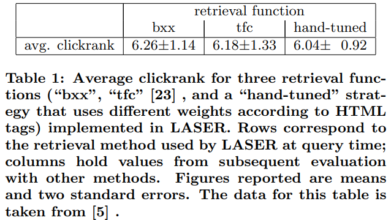
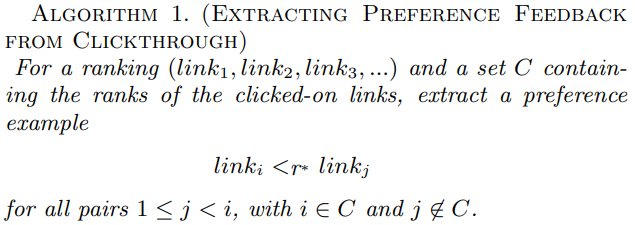

# [推荐系统论文笔记]Optimizing Search Engines using Clickthrough Data

用点击数据优化搜索引擎

## 摘要

本文提出了一种使用点击数据 (clickthrough data) 自动优化搜索引擎检索质量的方法。 直观地说，一个好的信息检索系统应该在排名靠前的位置显示相关文档，在靠后的位置列出相关性较低的文档。 虽然以前存在从示例中学习检索函数的方法，但它们通常需要从专家的相关性判断中生成的训练数据。 这使得它们应用起来困难且代价高。 本文的目标是开发一种**利用点击数据进行训练**的方法，即搜索引擎的查询日志 (query-log) 与用户在所呈现的排名结果中点击的链接日志相关联。点击数据可用量大，并且记录成本较低。 本文采用**支持向量机 (SVM) 方法**，提出了一种**学习检索函数**的方法。 从理论的角度来看，这种方法在风险最小化框架中被证明是有根据的。 此外，即使对于大量查询和特征集，它也被证明是可行的。 理论结果在实验中得到验证。 结果表明，该方法可以有效地使元搜索引擎的检索功能适应特定的用户群，仅在几百个训练示例后就检索质量优于谷歌。

## 1 介绍

当用户在搜索引擎中键入一些关键字时，他实际上想要检索哪些 WWW 页面？通常有数千个页面包含这些词，但用户只对一个很小的子集感兴趣。我们可以简单地要求用户提供反馈。 如果我们知道与用户查询实际相关的页面集，我们可以将其用作优化（甚至个性化）检索功能的训练数据。

不幸的是，经验表明用户很少愿意提供明确的反馈。 然而，本文认为 WWW 搜索引擎的日志文件中已经隐藏了足够的信息。 主要搜索引擎每天接收数百万次查询，因此此类数据非常丰富。 与通常在费力的用户研究中获得的显式反馈数据相比，可以从日志文件中提取的任何信息实际上都是免费的，而且本质上更及时。

本文提出了一种方法，**通过分析用户在当前排名中点击了哪些链接来学习检索功能**。 这引出了使用偏好示例进行学习的问题，例如“对于查询 $q$，文档 $d_a$​ 的排名应该高于文档 $d_b$​​”。 更一般地说，我将根据经验风险最小化来公式化在有限域上学习排序函数的问题。 对于这个公式，我将展示一个支持向量机 (SVM) 算法，该算法导致一个凸 program 并且可以扩展到非线性排序函数。 实验表明，该方法可以成功地为元搜索引擎学习一个高效的检索功能。

此篇文章的结构如下。 它首先定义了点击数据是什么、如何记录它以及如何以偏好的形式使用它来生成训练示例。 然后第 3 节介绍了学习检索函数的一般框架，接着第 4 节中学习参数化排序的 SVM 算法。第 5 节基于实验结果评估该方法。

## 2 搜索引擎中的点击数据

搜索引擎中的点击数据可以被认为是由查询 $q$、呈现给用户的排序 $r$ 和用户点击的链接集合 $c$ 组成的三元组 $(q, r, c)$​。 图 1 举例说明了这一点：用户查询“支持向量机”，得到如图 1 所示的排序，然后点击排名为 1、3 和 7 的链接。由于每个查询对应一个三元组，因此潜在可用的数据量实际上是无限的。

显然，用户不会随意点击链接，而是做出（某种程度上）明智的选择。 虽然点击数据通常是嘈杂的，并且点击不是“完美”的相关性判断，但点击可能会传达一些信息。 关键问题是：如何提取这些信息？ 在推导如何分析点击数据的模型之前，让我们首先考虑如何记录它。

图1 查询支持向量机的排序结果。加粗的是用户点击的链接

### 2.1 记录点击数据

可以在不影响搜索引擎的功能和实用性的情况下，以很小的开销记录点击数据。 特别是，与明确的用户反馈相比，它不会为用户增加任何开销。 无论何时向用户显示结果排名，都可以轻松记录查询 $q$​ 和返回的排序 $r$​​。 为了记录点击次数，一个简单的代理系统可以保存一个日志文件。对于本文中的实验，使用了以下系统。

每个查询都分配了一个唯一的 ID，该 ID 与查询词 (query words) 和呈现的排序结果一起存储在查询日志中。 呈现给用户的结果页面上的链接不会直接指向建议的文档 (suggested document) ，而是指向代理服务器。 这些链接对查询 ID 和建议的文档的 URL 进行编码。 当用户点击链接时，代理服务器会在点击日志中记录 URL 和查询 ID。 然后代理会使用 HTTP 位置命令将用户转发到目标 URL。 此过程可以对用户透明，并且不会影响系统性能。

上述表明，点击数据容易记录，且成本很低。 现在让我们解决关键问题：如何以有原则且有效的方式对其进行分析。

### 2.2 点击数据传递了哪种信息？

$(q, r, c)$ 的三部分之间存在很强的依赖关系。 呈现的排序结果 $r$ 依赖于查询 $q$ ，具体则取决于由搜索引擎中实现的检索功能。此外，点击链接的集合 $c$ 取决于查询 $q$ 和呈现的排序结果 $r$。首先，如果链接与 $q$  相关，则用户更有可能点击链接 [16]。 虽然对于分析来说，这种依赖性是可取的和有趣的，但点击对呈现的排序结果 $r$ 的依赖性让事情变复杂了。 特别是，用户不太可能点击排名靠后的链接，而不管它的相关性如何。 在极端情况下，用户点击排名为 10000 的链接的概率几乎为零，即使它是与查询最相关的文档。 没有用户会将排名向下滚动到足以观察此链接的程度。 因此，为了从点击数据中获得可解释且有意义的结果，有必要适当考虑 $c$ 对 $q$ 和 $r$​ 的依赖关系并对其建模。

在定义这样的模型之前，让我们首先考虑一种对点击数据的不合理解释。 单击特定链接不能被视为绝对相关性判断。 考虑表 1 中的经验数据。数据取自 [5]，并由搜索引擎 LASER 记录 (覆盖 CMU 的计算机科学学院的 WWW) 。 该表显示了每个查询的点击的平均排名（例如，图 1 的示例是 (1+3+7) / 11=3.67）。
每个单元格包含平均超过 1400 次查询的三种检索策略的平均点击排名。 所有方法的平均点击率几乎相等。 但是，根据主观判断，这三种检索功能在排名质量上存在较大差异。 观察到的平均点击排名没有差异可以解释如下：由于用户通常只扫描排序结果的前 $l$​（例如 $l ≈ 10 $​​ [24]）个链接，点击链接不能被视为绝对尺度上的相关性判断。 也许在列表中排名低得多的文档更相关，但用户从未见过它。 似乎用户点击了前 $l$​​ 个结果中（相对）最 promising 的链接，而与它们的绝对相关性无关。如何捕捉和分析这些相对偏好判断？

再次考虑图 1 中的示例。虽然无法推断链接 1、3 和 7 在绝对尺度上相关，但有理由推断，链接 3 比链接 2 更相关的概率高于随机 。 假设用户从上到下浏览排序结果，他一定在点击3之前观察到了链接2，决定不点击它。 鉴于与链接一起呈现的摘要信息量充足，这给出了关于用户偏好的一些指示。同理，可以推断出链接7比链接2、4、5、6更相关。这意味着点击数据传达的不是绝对相关性判断，而是用户浏览过的链接的部分的相对相关性判断。 搜索引擎根据与 $q$ 的相关性对返回的链接进行排名，应该将链接 3 排在 2 之前，将链接 7 排在 2、4、5 和 6 之前。 用 $r^*$ 表示用户喜欢的排名结果，我们得到形式为
$$
\begin{align}
link_3 <_{r^*} link_2 \ \ \ \ \ \ \
&link_7 <_{r^*} link_2\\
&link_7 <_{r^*} link_4 \\
&link_7 <_{r^*} link_5 \\
&link_7 <_{r^*} link_6 \\
\end{align}
\tag1
$$
这种提取偏好反馈的策略总结在以下算法中。

不幸的是，这种类型的反馈不适合标准机器学习算法。 下面推导出一种新的学习算法，让这种“弱”相对反馈可以作为训练数据。

## 3 一个用于学习检索函数的框架

信息检索问题可以形式化如下。 对于查询 $q$​ 和文档集合 $D = {d_1,...,d_m}$​​，最佳检索系统应该返回一个排序 $r^*$​​，根据它们与查询的相关性对 $D$​ 中的文档进行排序。 虽然查询通常仅表示为一组关键字，但更抽象地说，它还可以包含有关用户和信息搜索状态的信息。

通常，检索系统不会达到最佳排序 $r^*$​​​​​​​​​​​​​。 相反，一个可行的检索函数 $f$​​​​​​​​​​​​​ 是通过其排序 $r_{f(q)}$​​​​​​​​​​​​​ 与最优结果的接近程度来评估的。 形式上，$r^∗$​​​​​​​​​​​​​ 和 $r_{f_{(q)}}$​​​​​​​​​​​​​ 都是 $D × D$​​​​​​​​​​​​ 上的二元关系，满足弱排序的性质，即 $r^∗ \subset D \times D$​​​​​​​​​​​​ 和 $r_{f(q)} \subset D \times D$​​​​​​​​​​​​ 是非对称的，并且是负传递的 (negatively transitive) 。 如果对于排序 $r$​​​​​​​​​​ ，文档 $d_i$​​​​​​​​​​ 的排名高于 $d_j$​​​​​​​​，即 $d_i <_r d_j$​​​​​​​​ ，则 $(d_i, d_j ) \in r$​​​​​​​​，否则 $(d_i, d_j) \notin r$​​​​​​。 如果没有另外说明，为了简单起见，我们假设 $r^∗$​​​​ 和 $r_{f(q)}$​​​ 都是严格的排序。 这意味着对于所有对 $(d_1, d_2) \in D \times D$​​ 要么 $d_i <_r d_j$​ 要么 $d_j <_r d_i$​。 然而，将以下大部分结果推广到 $r^∗$​ 是弱排序的情况是很简单的。

系统排序 $r_{f(q)}$​ 和目标排序 $r^∗$​ 之间相似性的合适度量是什么？对于二元相关性尺度，平均精度 [1] 最常用于信息检索。 然而，大多数信息检索研究人员都同意二元相关性非常粗糙，它仅用作简化假设。
由于下面介绍的方法不需要这样的简化，我们将脱离二元相关性方案并采用 Kendall 的 $\tau$​ [19] [21] 作为性能度量。 为了比较两个随机变量的序数 (ordinal) 相关性，Kendall 的 $\tau$​ 是统计学中最常用的度量。 对于两个有限严格排序 $r_a \subset D \times D$​ 和 $r_b \subset D \times D$​，Kendall的 $\tau$​ 可以基于一致对 (concordant pairs) 的数量 $P$​ 和不一致对 (discordant pairs)（反转）的数量 $Q$​ 来定义。 一个对 $d_i \neq d_j$​ 是一致的，如果 $r_a$​ 和 $r_b$​ 对 $d_i$​ 和 $d_j$​ 的排序方式相同。 如果不相同，那是不一致的。 请注意，在 $m$​ 个文档的有限域 $D$​ 上，对于严格排序，$P$​ 和 $Q$​ 的总和为 $\Big(\begin {matrix}m \\2\end {matrix} \Big)$​。 在这种情况下，肯德尔的 $τ$​​ 可以定义为：
$$
\tau(r_a,r_b)=\frac{P-Q}{P+Q}=1-\frac{2Q}
{\Big(\begin {matrix}m \\2\end {matrix} \Big)}
\tag2
$$

$$

$$
