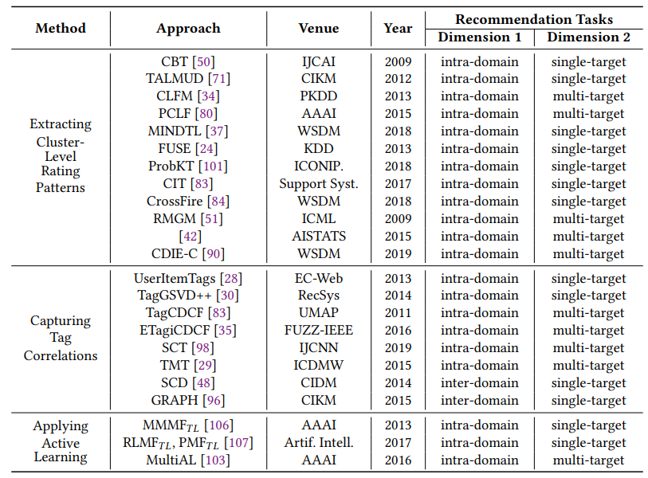
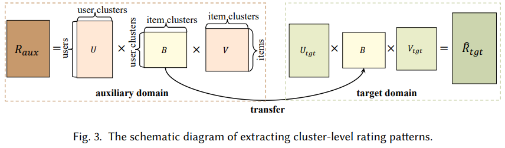
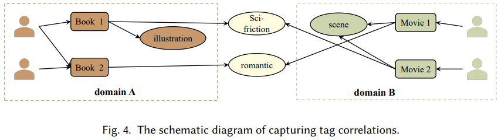

# A Survey on Cross-domain Recommendation: Taxonomies, Methods, and Future Directions

上海交大，2021

## 摘要

传统推荐系统面临着数据稀疏和冷启动两个长期存在的障碍，这促进了跨域推荐（CDR）的出现和发展。  CDR 的核心思想是利用从其他域收集的信息来缓解一个域中的两个问题。 在过去的十年中，跨域推荐已经进行了许多努力。 最近，随着深度学习和神经网络的发展，出现了大量的方法。 然而，关于 CDR 的系统调查数量有限，特别是关于最新提出的方法以及它们所解决的推荐场景和推荐任务。 在这篇调查论文中，我们首先提出了跨域推荐的两级分类法，它对不同的推荐场景和推荐任务进行分类。 然后，我们以结构化的方式介绍和总结不同推荐场景下现有的跨域推荐方法。 我们还组织了常用的数据集。 我们通过提供有关该领域的几个潜在研究方向来结束本调查。

## 1 介绍

在信息爆炸的时代，人们很容易被大量的信息淹没。 数以百万计的新产品、文字和视频一直在发布，这使得人们很难找到他们感兴趣的物品。 用户的历史交互被认为包含有关用户兴趣的丰富信息，可用于预测他们未来的兴趣。 这促进了推荐系统（RS）的出现。  RS的基本思想是分析和估计用户的兴趣，然后从大量的候选物品中选出用户可能感兴趣的物品并推荐给用户

尽管推荐系统已被证明在各种应用中发挥着重要作用，但有两个长期存在的障碍极大地限制了推荐系统的性能。 一方面，用户-物品交互记录的数量往往较少，不足以很好地挖掘用户兴趣，这称为数据稀疏问题。 另一方面，对于任何服务，都有不断有新用户加入，没有历史交互记录。 传统的推荐系统无法对这些用户进行推荐，这就是所谓的冷启动问题。 随着越来越多的用户开始与多个领域（例如音乐和书籍）进行交互，这增加了利用从其他领域收集的信息来缓解一个领域中的两个问题（即数据稀疏性和冷启动问题）的机会 . 这个想法导致了跨域推荐（CDR），近年来引起了越来越多的关注。
与传统推荐系统相比，跨域推荐更加复杂。

首先，考虑到两个域的用户集和物品集之间的关系，跨域推荐存在不同的推荐场景，例如用户有重叠或非重叠[25, 45]。 其次，跨域推荐的推荐任务多种多样。 例如。 推荐物品和用户可能在同一个域或不同的域中。 推荐的目标可能是提高一个特定领域或多个领域的性能。 第三，传统的推荐系统只需要关注如何从历史交互记录中对用户兴趣进行建模。 对于跨域推荐，除了对域内的用户兴趣建模外，还需要考虑如何在域之间迁移知识（即用户兴趣）。 这就引出了跨域推荐的两个核心问题，即迁移什么和如何迁移。 迁移的是如何挖掘各个领域的有用知识，迁移的重点是如何建立领域间的联系，实现知识的迁移。

在过去十年左右的时间里，跨域推荐已经有了许多探索。 为了回答转移什么的问题，现有的研究致力于应用不同的方法来提取每个领域的有用知识。 传统的机器学习方法，如矩阵分解[85、91]、分解机[56、62]、协同聚类[50、71、90]和潜在语义分析[63、87]已被广泛应用。 近年来，随着深度学习技术的出现和发展，许多基于深度学习的方法被提出 [27, 33, 38, 39, 65, 92, 104]，大大提高了跨域推荐的准确率和性能。 为了回答如何迁移的问题，一个简单的想法是利用重叠的实体，无论是用户还是物品，直接在域之间建立关系 [23, 40, 77, 85, 92, 109, 111]。 当没有重叠实体时，还通过提取集群级别的模式 [50, 71, 84, 90] 或求助于其他辅助信息（例如，用户生成的标签、评论、用户配置文件和物品内容）[30, 83, 96, 98]。

在文献中，有一些关于跨域推荐的调查。 李等人[49]首先给出了一个简短的调查，他们提出存在三种不同类型的域，即系统域、数据域和时间域。 更具体地说，对于不同的系统域，有不同类型 (type) 的物品（例如，书籍和电影）或不同流派/风格 (genre) 的物品（例如，喜剧电影和小说电影）。 对于数据域，它指的是用户对物品的偏好可以存储在多种数据类型中（例如，显式数字评级数据和隐式二进制反馈数据），并且每种类型的数据都被视为一个域。 对于时间域，交互记录根据时间戳被划分为若干时间片，每个时间片构成一个域。 这种域分类方式被后来的研究人员广泛引用。 克雷莫内西等人[25]基于两个域的用户集和物品集之间的关系，确定了四种不同的跨域场景，即无重叠、用户重叠、物品重叠和完全重叠，这已被以下研究认可[31, 45]。 最近的调查是由 Khan 等人 [45]撰写的。他们对之前的调查进行了详细的比较和讨论，并确定了域类型、用户-物品重叠场景和推荐任务作为跨域推荐系统的三个构建块。 他们还对使能 (enabling) 算法、发现的问题和未来的方向进行了详细的总结和分析。

由于现有的跨域推荐调查已经发表了几年，我们发现它们不能满足当前该领域的研究需求。 我们写这个调查主要基于以下三个原因。 首先，现有调查中推荐场景和推荐任务的分类是粗粒度的。 结合跨域推荐研究的实际情况，可以进一步细化分类（详见2.2.1和2.2.2）。 例如，现有的调查只是将用户集和物品集之间的关系分为两种情况：重叠和不重叠。 我们建议重叠关系可以进一步分为部分重叠和完全重叠。 其次，在这些调查发布后，跨域推荐取得了许多重大进展。 特别是近年来基于深度学习的技术的日益普及和快速发展，极大地影响了跨域推荐领域。 因此，需要进行一项调查来总结跨域推荐的最新方法。 第三，由于跨域推荐存在不同的推荐场景和推荐任务，一种场景提出的方法往往不适用于另一种场景。 因此，在讨论现有研究时，必须根据推荐场景和任务的分类对其进行分类，而现有调查尚未很好地解决这一问题。

对于文献调查，找到每一个相关的工作是必不可少的。 我们采用了一种混合方法来搜索相关文献。 我们首先使用 Google Scholar 作为主要搜索引擎来发现相关论文。 然后我们筛选了大部分相关的高规格会议，如 NIPS、ICML、ICLR、SIGKDD、WWW、AAAI、SIGIR、IJCAI 和 RecSys，以找出最近的工作。 我们使用的主要关键字包括“跨域推荐”、“跨系统推荐”、“跨网络推荐”和“跨平台推荐”。 我们也注意每篇论文相关工作部分提到的参考文献，以防止遗漏相关文献。

本文的贡献总结如下：

- 我们提出了跨域推荐的原始两级分类法，该分类法基于用户/物品集和 4 个不同推荐任务的重叠识别了 9 个不同的推荐场景。
- 我们总结了现有的研究工作，并根据它们所解决的推荐场景和推荐任务对它们进行了基于方法的分类。
- 我们介绍了跨域推荐中常用的数据集，将它们分为不同的类别，并解释了如何在研究中使用它们。
- 我们概述了跨域推荐的进一步潜在研究方向。

本文的其余部分安排如下。 在第 2 节中，我们介绍了本文中采用的符号以及我们提出的关于跨域推荐场景和推荐任务的两级分类法。 在第 3-5 节中，我们分别以结构化的方式总结并在三个广泛研究的推荐场景下对现有跨域作品进行基于方法的分类。 第 6 节将介绍跨域推荐中常用的数据集。 在第 7 节中，我们提出了潜在的未来搜索方向。 最后，我们在第 8 节总结本文。

## 2 分类法

在本节中，我们首先介绍本文中采用的相关符号。 然后我们介绍了我们提出的推荐场景和推荐任务的两级分类法，然后是不同推荐场景下现有研究的基于方法的分类。

### 2.1 符号表示

不失一般性，我们仅考虑包含两个域 $D^A$ 和 $D^B$ 的跨域推荐。 这里介绍的符号可以很容易地扩展到具有多个域的情况。${\cal U}^A$ 和 ${\cal I}^A$ 分别表示 $D^A$ 域中的用户集合、物品集合（同理可得$D^B$ 的）。两个矩阵 ${\bold R}^A \in {\mathbb R}^{m^A \times n^A}$ 和 ${\bold R}^B \in {\mathbb R}^{m^B \times n^B}$ 分别表示两个域中用户与物品的交互，其中 $m^A=|{\cal U}^A|,n^A=|{\cal I}^A|$ 分别表示 $D^A$ 域中的用户数量和物品数量（另一个域同理）。每个元素 $r_{mn} \in {\bold R}^A$ (或${\bold R}^B$) 可以是表示用户对物品的显式评分的数字，也可以是表示用户-物品对之间隐式交互（例如，点击、购买、添加到购物车）的二进制数。此外，每个域中，可能有另外两个矩阵 ${\bold X}^A \in {\mathbb R^{m^A \times p^A}},{\bold Y}^A \in {\mathbb R^{n^A \times q^A}}$ （另一个域同理）分别表示用户画像和物品属性。

## 3 场景1：用户非重叠&物品非重叠

由于不同领域信息的独立性和隔离性，两个领域的用户集和物品集不重叠，甚至存在一些重叠的用户或物品，无法识别，对应不可用。 这导致了第一个推荐场景，其中用户集和物品集都不重叠，这在早期的跨域推荐中得到了广泛的研究。 具体来说，针对这个推荐场景有三类方法，即

（𝑖）提取集群级别的评分模式，

（𝑖𝑖）捕获标签相关性，

（𝑖𝑖𝑖）应用主动学习技术。

表 3 显示了现有方法的基于方法的分类。

表3 针对用户非重叠和物品非重叠的推荐场景现有方法的基于方法的分类。

### 3.1 提取 cluster-level 的评分模式

#### 3.1.1 基本范式

第一类方法假设域的服务面向一般人群，不同域的用户可能具有相似的偏好，而物品也可能共享某些属性。 尽管域之间没有重叠的用户/物品，但两个域可能共享集群级别的评级模式。 因此，此类方法旨在从一个域中提取集群级别的评级模式并将其转移到另一个域。 图 3 显示了这种方法的示意图，我们在下面描述细节。

#### 3.1.2 此方法的处理方式

#### 3.1.3 扩展到多目标域推荐

### 3.2 捕获标签关联 (tag correlation) 

#### 3.2.1 基本范式

该方法基于这样的假设：尽管用户和物品在域之间不同，但用户可能使用相同的标签来注释感兴趣的物品，并且不同域中的物品可能被相同的标签标记以对其属性进行编码。 如图 4 所示，域 A 和域 B 具有不同的用户和物品。 域 A 使用标签{𝑖𝑙𝑙𝑢𝑠𝑡𝑟𝑎𝑡𝑖𝑜𝑛，𝑠𝑐𝑖 - 𝑓𝑟𝑖𝑐𝑡𝑖𝑜𝑛，𝑟𝑜𝑚𝑎𝑛𝑡𝑖𝑐}用户标记的书籍，而用户在域 B 使用标签{𝑠𝑐𝑒𝑛𝑒，𝑠𝑐𝑖 - 𝑓𝑟𝑖𝑐𝑡𝑖𝑜𝑛，𝑟𝑜𝑚𝑎𝑛𝑡𝑖𝑐}到标签的电影，所以这两个标签“科幻摩擦”和 “浪漫”在这两个领域都存在。 因此，这种方法转向用户生成的标签来建立不同域之间的链接。 具体来说，有两种方法可以捕获标签相关性。 一方面，标签可用于同时增强用户和物品的配置文件。 另一方面，用户、物品和标签之间的相似性矩阵可以基于标签生成，然后用作约束来学习更好的用户和物品表示。

#### 3.2.2 此方法的处理方式

为了增强用户和物品的配置文件，Enrich 等人[28]首先提出利用标签作为隐式用户反馈来增强物品因素。 他们提出了一种基于 SVD++ [46] 算法的基于标签的跨域协同过滤方法，探索三种不同的自适应。 费尔南德斯-托比亚斯等人 [30] 声称 [28] 中提出的方法没有充分利用用户在分配给物品的标签中表达的偏好。 他们进一步提出了一种基于 GSVD++ [69] 的名为 TagGSVD++ 的方法，该方法同时使用他们使用的标签丰富用户的个人资料，并使用他们收到的标签扩展物品的个人资料。

#### 3.2.3 扩展到域间推荐

### 3.3 应用 active learning

#### 3.3.1 基本范式

这种方法涉及在固定预算内一定数量的人力。 例如，起初，不同域之间没有明确的实体（即用户或物品）对应关系，一些用户/物品有时会重叠。 识别所有用户对应关系既昂贵又耗时，但可以在固定预算内识别少量用户或物品的部分映射。 另外，通过人工可以得到更多的评分，缓解了数据稀疏的问题

## 4 场景2：用户部分重叠&物品无重叠

对于这种推荐场景，一些用户在两个域中都有交互，而其他用户只在特定域中进行交互。 它与物品部分重叠和用户不重叠的场景是对称的。 本节中讨论的方法可以应用于这两种推荐场景。 特别地，这些方法可以分为五类，即

（𝑖）集体矩阵分解，

（𝑖𝑖）重叠用户的表示组合，

（𝑖𝑖𝑖）嵌入和映射，

（𝑣）基于图神经网络的方法，

（𝑖𝑣）捕获 aspect 的相关性。 

表 4 显示了针对此推荐场景的现有方法的基于方法的分类的简单总结。

### 4.2 重叠用户的表示组合

#### 4.2.1 基本范式

图 6 显示了这种方法的示意范例。 我们可以看到，通常有三层。 嵌入层为每个域中的用户和物品生成嵌入。 在组合层中，将来自两个域的重叠用户的嵌入组合起来，为重叠用户生成统一的嵌入。 最后，预测层采用不同用户和重叠用户的嵌入分别在每个域上训练推荐模型。

【图6】

#### 4.2.2 此方法的处理

Zhu等人 [109]首先提出了这种双目标跨域推荐（DTCDR）范式，其核心思想是共享跨域重叠用户的知识。具体来说，在嵌入层，它从评分和内容信息为每个域中的用户和物品生成嵌入。 在组合层中，重叠用户的嵌入通过三种不同的组合操作进行组合，即串联、最大池化和平均池化。 Zhu等人 [111] 然后提出了双目标跨域推荐（GA-DTCDR）的图形和注意框架。

在嵌入层，它应用图嵌入技术（即 Node2vec）在每个域中生成更具代表性的用户和物品嵌入。 在组合层，它采用了逐元素注意力机制来更有效地组合重叠用户的表示。

这种方法的一些处理侧重于捕捉用户偏好的动态特性。 佩雷拉等人建议将时间戳、跨网络信息用于新的（即不同的用户）和现有的（即重叠的用户）用户推荐 [75]。 在嵌入层，他们通过每个领域的主题建模生成用户的主题分布。 在组合之前，两个传递函数将用户偏好从主题空间映射到目标网络用户空间。 在组合层中，通过融合来自两个域的用户偏好来获得重叠用户的表示。 后来，他们进一步提出了一种时间感知统一跨网络解决方案[77]，该解决方案在嵌入层中，在每个域的短期、长期和长期短期级别下对用户偏好进行建模。 然后，在组合层中，将重叠用户（在其论文中称为现有用户）的两个域中的三级偏好表示进行整合，以获得用户的最终表示。 不同用户（称为新用户）的表示是通过融合来自源域的三种表示直接生成的。

### 4.3 嵌入和映射

#### 4.3.1 基本范式

这是一种域间推荐方法，其中一个域被视为源域，另一个域被视为目标域。 图 7 显示了该方法的示意图。 有三个主要步骤，即潜在因子建模、潜在空间映射和跨域推荐。 在潜在因子建模过程中，目标是在每个域中生成用户和物品潜在因子 $\{𝑈^𝑠 ,𝑉^𝑠 ,𝑈^𝑡 ,𝑉^𝑡\}$。 在潜在空间映射期间，目的是训练映射函数 $𝑓_𝑈$ 。$𝑓_𝑈$ 的目标是建立域的潜在空间之间的关系：
$$
\min_\theta \sum_{u_i \in \cal U}L(f_U(U^s_i;\theta),U^t_i)
$$
在跨域推荐过程中，对于一个在源域中只有一个潜在因子的用户，它会生成该用户在目标域中的潜在因子：
$$
\hat U^t_i=f_U(U^s_i;\theta)
$$
使用 $\hat 𝑈^𝑡_𝑖$ ，可以向该用户执行目标域中的推荐。

#### 4.3.2 此方法的处理

跨域推荐的嵌入和映射框架（EMCDR）首先由 Man 等人提出。  [67]针对域间推荐问题。 对于潜在因素建模，EMCDR 分别应用矩阵分解 (MF) 和贝叶斯个性化排名 (BPR) 来生成用户和物品潜在因素。 对于潜在空间映射，它利用基于多层感知器（MLP）的线性函数和非线性函数作为映射函数。 目标是将 $𝑓_𝑈$ 映射的源域中重叠用户的潜在因子 $𝑈^𝑠_𝑖$ 与目标域中相应的潜在因子 $𝑈^𝑡_𝑖$ 近似。

这一思想得到了很多研究者的广泛改进，改进主要体现在两个方面，一是潜在因子建模过程，二是潜在空间映射过程。

对于潜在因子建模，Wang 等人[89] 提出了跨域潜在特征映射（CDLFM）模型。它首先定义了三个关于用户评分行为的相似性度量。 在潜在因子建模期间，相似性值作为约束嵌入到矩阵分解过程中。 傅等人提出了一种基于评论和内容的深度融合模型（RC-DFM）。它扩展了堆叠去噪自编码器，以有效地将评论文本和物品内容与评分矩阵融合，以生成具有更多语义信息的用户和物品表示。 毕等人 [20, 21] 提出构建异构信息网络并考虑交互序列信息以学习每个域中的有效用户/物品表示。 所提出的方法被证明在跨域保险推荐中是有效的。

对于潜在空间映射，朱等人 [110] 为跨域和跨系统推荐提出了一个深度框架（DCDCR），该框架考虑了单个用户/物品的评级稀疏度以生成基准因子矩阵。 映射函数被训练来映射用户和物品的潜在因子矩阵以适应基准因子矩阵。 康等人[44]提出，在现有的基于 EMCDR 的方法中，映射函数的训练只使用重叠用户，因此它们的性能对重叠用户的数量很敏感。 在对 Amazon 数据集进行深入分析后，他们提出，在现实世界的数据集中，重叠用户的数量总是很少，这限制了现有方法的性能。 因此，他们提出了跨域推荐（SSCDR）的半监督框架，以利用重叠用户和源域物品来训练映射函数

#### 4.3.3 扩展到域内推荐

上述方法用于域间推荐，因为它们都学习了不同域之间的映射函数，并将源域中的用户表示映射到目标域。 张等人[102]进一步将此方法应用于域内推荐。 他们提出用户的兴趣和状态可能会随着时间的推移而变化，快速捕捉这些变化以获得及时准确的推荐非常重要。 因此，他们首先根据交互时间戳将用户交互物品的序列划分为项集，以表示用户在一段时间内的兴趣。 提出的循环生成网络 (CGN) 不像以前基于 EMCDR 的方法那样捕获不同域中用户表示之间的映射关系，而是在同一时间学习了用户在不同域中的交互项集表示之间的个性化双向映射函数时期。

### 4.5 捕获 aspect 相关性

#### 4.5.1 基本范式

除了之前介绍的嵌入和基于映射的方法之外，捕获 aspect 相关性是另一种域间推荐的方法。 它假设用户的偏好是多方面的，旨在对细粒度的语义 aspect 进行建模并探索他们跨领域的相互关系。 可以通过匹配一个域中的用户和另一个域中的物品的 aspect 特征来执行分数预测。

#### 4.5.2 该方法的处理

赵等人 [105] 提出了一个通过 aspect 迁移网络（CATN）的跨域推荐框架来捕捉用户的多方面和细粒度的偏好。 它首先通过包含该用户撰写的所有评论的用户文档来表示用户，并通过包含其收到的所有评论的物品文档来表示物品。 然后它为每个用户和他们文档中的每个物品生成抽象 aspect 特征。利用重叠用户的方面特征来识别全局跨域 aspect 的相关性。域间推荐可以利用源域中用户的评论文档和目标域中物品的评论文档进行，反之亦然。具体来说，评分预测是通过聚合用户和物品的 aspect 特征中两个 aspect 之间的语义匹配来获得的。

