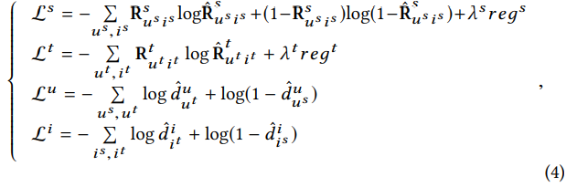
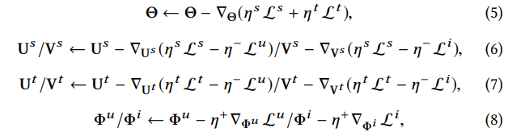
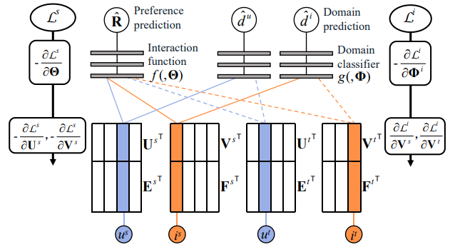

# 【推荐系统论文笔记】TDAR: Semi-supervised Collaborative Filtering by Text-enhanced Domain Adaptation

TDAR：**T**ext-enhanced **D**omain **A**daptation **R**ecommendation

## 摘要

------

数据稀疏性是推荐系统的固有挑战，其中大部分数据是从用户的隐式反馈中收集的。这给设计有效算法带来了两个困难：

- 第一，大多数用户与系统的交互很少，没有足够的数据可供学习；
- 其次，隐式反馈中没有负样本，执行负采样生成负样本是一种常见的做法。然而，这会导致许多潜在的正样本被错误标记为负样本，而且数据稀疏会加剧错误标记（mislabeling）问题。

为了解决这些困难，我们将稀疏隐式反馈的推荐问题视为半监督学习任务，并探索域自适应（domain adaptation）来解决它。我们将从密集数据中学到的知识转移到稀疏数据中，而且我们重点关注最具挑战性的情况——没有用户或物品重叠。

在这种极端情况下，直接对齐（align）两个数据集的embeddings是次优的（sub-optimal），因为两个潜在空间（latent space）的编码信息差别很大。因此，我们采用域不变（domain-invariant）的文本特征作为锚点来对齐潜在空间。为了对齐embeddings，我们提取每个用户和物品的文本特征，并将它们输入到具有用户和物品的embeddings的域分类器中。这些embeddings被训练用于迷惑（puzzle）分类器，文本特征被固定为锚点。通过域自适应，源域中的分布模式被迁移到目标域。由于目标域的部分可以通过域适应来监督，我们放弃了目标域数据集中的负采样以避免标签噪声。

我们采用三对真实世界的数据集来验证我们的迁移策略的有效性。结果表明，我们的模型明显优于现有模型。

------

## 关键词

迁移学习、域自适应、协同过滤、物品推荐、用户评论、对抗性学习。

## 1 引言  INTRODUCTION

由于在电子商务和视频网站等各种在线平台上的普遍应用，推荐系统获得了广泛的研究关注。在实际应用中，隐式反馈数据（一类数据，如点击和购买等）被广泛使用，因为它易于收集且普遍适用（generally applicable）。实际应用中的推荐通常存在严重的稀疏性问题，这会导致两个困难：

(1) 没有足够的交互来为模型学习提供信息。此外，数据高度不平衡：大多数用户和物品与系统只有很少的交互，这使得推荐任务更加困难。 
(2) 由于我们在隐式反馈中只观察到一小部分正样本，现有的负采样策略是将未观察到的样本视为负样本 [6, 18, 21, 25, 27]。
然而，通过这种方式，许多潜在的正样本被错误地标记为负样本，并且模型被标签噪声严重误导，尤其是在稀疏数据上。

为了解决上述挑战，我们采用迁移学习来丰富稀疏数据集上的信息，并且我们专注于没有用户和物品重叠的跨域推荐。具体来说，我们分别在稠密和稀疏数据上训练源模型和目标模型，并探索域自适应 [4, 5] 以对齐embeddings（即潜在因子 latent factors），这是协同过滤 (CF) 模型中对用户偏好进行编码的关键组成部分。我们将从密集数据中学到的知识（如分布模式）迁移到稀疏数据中，以学习它更好的embeddings。考虑到目标模型同时受到正样本和域适应机制的监督，我们不对稀疏数据进行负采样以避免标签噪声问题。正如我们所见，学习目标模型是一项半监督学习任务。

为了说明我们的策略，我们首先简要介绍域自适应。Ganin等人[5] 提出了用于无监督图像分类任务的域对抗性神经网络 (DANN)。在 DANN 中，训练一个特征提取器来提取视觉特征，同时训练一个域分类器来辨别当前特征来自哪个域（分类）。通过对抗地训练特征提取器来迷惑域分类器，两个域的视觉特征被对齐，而且从源域中学到的知识被迁移到了目标域。域自适应的更多细节可以在第 2.1.1 小节中找到。

在本文中，我们的目标是在推荐任务中通过域适应来对齐embeddings，但面临一个关键问题。我们在图 1 中说明了 vanilla DANN 和我们的策略。 DANN 被提出并被用于图像分类任务，它在视觉空间中对齐高级的（high-level）图像表示。由于两个域共用相同的特征提取器，来自两个域的图像被映射到相同的空间，因此语义相似的图像分布在此空间中的相似位置。通过域自适应，具有相似语义的集群（clusters）被对齐在一起，且分布模式被迁移以改善（refine）目标域上的表示。以图 1 (a) 中展示的视觉空间为例，负半轴和正半轴分别编码猫和狗，因此来自不同域的猫都映射到负半轴并通过域自适应对齐在一起。

图1 计算机视觉任务和推荐任务中的域适应示例。我们使用不同的颜色来区分两个域，使用实线和虚线来区分不同的类别。为了简洁，视觉空间、潜在空间和文本空间都表示为一维空间。

然而，在基本的 CF 模型中，没有具有特定语义的数据（例如图像和文本），我们通过将用户和物品嵌入（embedding）到潜在空间中来提取高级的密集特征。通过这种方式，我们将来自不同领域的用户和物品映射到不同的潜在空间。以图1 (b)中的电影为例，实线和虚线分别表示恐怖片和喜剧片。如图1 (b) 所示，直接对齐embeddings可能会引起误导——来自“橙色”域的恐怖电影和来自“蓝色”域的喜剧被聚集在一起，并且分布模式被错误地迁移移。原因是这些embeddings被映射到不同的潜在空间——在“橙色”域上，负半轴和正半轴分别编码恐怖和有趣，而在“蓝色”域上，我们面临相反的情况。为了解决这个间隔 / 差距（gap），我们需要在同一个空间中进行域适应，即我们既对齐空间又对齐embeddings。

为了对齐潜在空间，我们探索域不变特征作为锚点。在本文中，我们利用了可以从用户评论（review）中轻松提取的文本特征。一个例子如图 1 (c) 所示，我们将文本特征与embedding连接（concatenate）起来，从而将空间扩展为文本潜在空间（横轴表示潜在空间，纵轴表示文本空间）。在图 1(b) 所示的潜在空间中，不同的类别是不可分离的，而在图 1(c) 中，不同的类别可以通过扩展文本维度来分离。对于域自适应，我们使用连接的embeddings和文本特征作为域分类器的输入。embeddings使用分类器进行对抗训练，而文本特征则固定。

正如我们所见，在我们的策略中，文本特征应该是域不变的，例如，来自所有域的恐怖电影都映射到文本空间的负半轴。现有的许多模型 [2, 30] 提取文本特征用于推荐，而这些特征不是域不变的。为了缩小这一差距，首先，我们提出了一种称为文本记忆网络 ( Text Memory Network，TMN) 的记忆结构，通过将每个用户和物品映射到单词语义空间（word semantic space）来提取文本特征。​然后，我们将这些特征注入 CF 模型以生成预测。这个由文本特征和CF模块组成的模型被命名为文本协同过滤（Text Collaborative Filtering，TCF）模型。最后，我们在源域和目标域上同步训练两个 TCF 模型，并通过自适应网络将它们连接起来。这个迁移学习模型被命名为文本增强域自适应推荐 (Text-enhanced Domain Adaptation Recommendation，TDAR) 方法。

具体来说，我们的贡献如下：

- 我们通过将embeddings对齐到相同的潜在空间来提出一种域自适应推荐方法（TDAR），这大大提高了稀疏数据集的性能。为了对齐空间和embeddings，我们使用文本特征作为锚点。
- 作为 TDAR 中的一个重要模块，我们设计了一个记忆网络来提取域不变的文本特征，并将这些特征注入到 CF 模型中以提出基于文本的 CF 模型。
- 我们在三对真实世界数据集上设计了综合实验，以证明我们提出的方法的有效性。代码可在 https://github.com/Wenhui-Yu/TDAR 上获得。

## 2 相关工作

最近，推荐系统（RS）因其在各种在线平台上的广泛应用而受到越来越多的关注。我们根据历史交互对用户偏好进行建模，并将个性化推荐返回给每个用户。在各种 RS 模型中，CF 模型以直接 [7, 22] 和高级 [13, 20] 方式从用户-物品交互图中挖掘协同信息（collaborative infromation）。隐语义模型 / 潜在因素模型（latent factor models） [8, 13, 20] 被认为是一种特殊的 CF 模型，使用embeddings对用户偏好和物品属性进行编码，并测量embeddings在潜在空间中的距离。为了提高表示能力，已经提出了许多变体 [6, 24, 26, 28, 30]。虽然进行了广泛的研究，但是仍然存在一个关键问题：RS 存在严重的稀疏问题，并且在稀疏数据上的性能还有很多不足之处。在本文中，我们的目标是利用迁移学习来丰富稀疏数据的信息，并使用文本特征作为锚点，因此我们在本节中介绍了最相关的方面：跨域推荐和基于文本的推荐。

### 2.1 跨域推荐

在本小节中，我们首先介绍核心技术——域自适应，然后介绍一些关于有重叠和无重叠的跨领域推荐的相关工作。

#### 2.1.1 域自适应

为了学习只有残缺的标签甚至没有标签的数据，迁移学习被提出，将从标记良好的源数据集学到的知识迁移到目标数据集 [1, 4, 5, 15] 。Ganin等人[5]提出了用于无监督图像分类任务的 DANN。假设$\{{\bf x}_i^d, y_i^d\}_{i=1,...,m;d=S}$是带标记的源数据，$\{{\bf x}_i^d\}_{i=1,...,n;d=T}$是无标记的目标数据。DANN有三部分：一个特征提取器$G_f(,\theta_f)$（CNN的卷积层），一个标签预测器$G_y(,\theta_y)$（CNN的全连接层）和一个域分类器$G_d(,\theta_d)$。模型训练的时候，分别在在源域更新 $\theta_f$ 和  $\theta_y$ 来最小化标签预测损失$\sum_iL(G_y(G_f({\bf x}_i^S,\theta_f),\theta_y),y_i^S)$和训练 $\theta_d$ 和 $\theta_f$ 来最小化域预测损失$\sum_{i,d}L(G_d(G_f({\bf x}_i^d,\theta_f),\theta_d),d)$。通过对抗地训练 $\theta_d$ 和 $\theta_f$ ，两个域的视觉特征 $G_f({\bf x}_i^S, \theta_f)$ 和 $G_f({\bf x}_i^T, \theta_f) $ 被对齐了，而且从源域学到的知识也被迁移到了目标域。

#### 2.1.2 有重叠的跨域推荐

有许多模型被提出用于有用户和物品重叠的跨域推荐。

- 潘等人[19] 通过直接最小化源embeddings和目标embeddings之间的距离的 Frobenius 范数来减小二者的差异。
- 卢等人[16] 提出了一种选择性迁移学习方法，该方法基于 boost 算法决定要迁移的内容。
- 胡等人[9] 在源域和目标域上提出了两个深度神经网络，通过共享用户embeddings层，将所有用户和物品映射到同一个潜在空间，通过构建两个网络之间的交叉连接（cross connections），实现参数跨域迁移。
- 袁等人[29] 通过自动编码器对每个用户进行编码，并通过域自适应对齐用户表示。
- 胡等人[10]使用在源域上与当前用户有交互的物品来增强目标域上的当前物品的表示，并使用用户评论来提高模型性能。

我们可以看到迁移学习很容易实现，因为存在用户和物品重叠。在这种情况下，两个域的用户-物品二分图是整个图的不同部分，我们可以通过简单地在两个域之间共享重叠用户和物品的embeddings来迁移知识。然而，如果没有重叠，两个图是完全独立的，embeddings是不可共享的，因此我们必须使用更高级的方法，例如域自适应。

#### 2.1.3 无重叠的跨域推荐

无重叠的跨域推荐有多种模型。

- Kanagawa等人[11] 介绍了一个有趣的任务——基于文本将源域中的物品推荐给目标域中的用户。为了实现这个目标，用自动编码器提取文本特征并通过域自将它们对齐。 
- Wang 等人 [23] 提出了长短期记忆（LSTM）来构建用户和物品的文本表示，并将两个域的它们对齐用于迁移学习。

正如我们所看到的，这些模型 [11, 23] 在文本空间中实现了域自适应，因为embeddings很难在没有重叠的情况下对齐。在这种情况下，[11, 23] 中的跨域推荐更接近于自然语言处理 (NLP) 任务而不是推荐任务。 

- Li 等人[14] 提出了一种“码本（codebook）”方法，该方法在集群级别（cluster-level）迁移评分模式，但过于粗糙和经验主义。此外，该方法基于用户的评分模式，因此难以扩展到隐式反馈的情形。

在本文中，我们的目标是改进embeddings，这是 CF 模型的关键表示。据我们所知，本文是第一篇专注于无用户和物品重叠的跨域推荐任务的embeddings对齐的工作。

### 2.2 基于文本的推荐

由于我们想使用文本特征作为锚点来对齐embeddings，我们为每个用户和物品提取域不变的文本特征。在本小节中，我们将介绍一些基于文本的推荐模型。 [11, 23]中介绍的基本模型都是基于文本的模型。

- Kanagawa等人[11] 设计了一个自动编码器，而且利用 LSTM 来提取用户和物品的文本表示。
- 郑等人[30] 为每个用户和物品聚集评论，并通过卷积神经网络 (CNN) 从这些评论中提取文本特征。
- Chen [2] 等人进一步增加了注意力机制。 

然而，这些现有模型提取的文本特征不是域不变的。受 [10] 的启发，我们在本文中提出了一种用于文本特征的记忆网络。

## 3 文本记忆网络

在本文中，粗体大写字母表示矩阵。假设总共有 $M$ 个用户和 $N$ 个物品，我们使用矩阵 ${\bf R} ∈ \mathbb R ^{M×N}$ 来表示用户和物品之间的交互。 如果用户 $u$ 投票给物品 $i$，则 ${\bf R}_{ui} = 1$，否则 ${\bf R}_{ui} = 0$。我们的任务是对缺失值（${\bf R}$ 中的 $0$）进行预测（表示为 $\hat {\bf R}$）。

在本节中，我们根据评论构建特定用户和特定物品（user- and item- specific）的文本表示。请注意，本节设计的模型是针对信号域的，我们分别提取源域和目标域的文本特征。以用户 $u$ 为例，我们构造了一个评论集 $R_u = \bigcup ^N _{i=1} r_{ui}$ ，其中 $r_{ui}$ 是一个包含 $u$ 对 $i$ 的评论的词的集合。如果 $u $与 $i$ 没有交互，则 $r_{ui} = \emptyset$。类似地，物品 $i$ 的评论集是 $R_i = \bigcup ^M _{u=1} r_{ui}$ 。我们用 $W$ 来表示词集：$W = \bigcup ^M _{u=1} \bigcup ^N _{i=1} r_{ui}$ ，用 $H$ 来表示词的总数：$H = |W|$。由于我们想要提取域不变的文本特征（即来自所有域的特征都在同一空间中），我们通过线性组合评论的词语义(word semantic)向量将所有用户和物品映射到词语义空间。${\bf S}\in \mathbb R ^{H\times K_1}$ 是word2vec[17]在GoogleNews语料库上预训练的词语义矩阵，${\bf S}_w$表示词$w$的语义特征。我们使用 ${\bf E} ∈ \mathbb R ^{M×K_1}$ 和 ${\bf F} ∈ \mathbb R ^{N×K_1}$ 分别表示我们为用户和物品构建的文本特征。以用户 $u$ 为例，${\bf E}_u = \sum_{w\in R_u} a_{uw} {\bf S}_w$ ，其中 $a_{uw}$ 是词 $w$ 基于 $u$ 的语义偏好的权重。我们提出了一个文本记忆网络 (TMN) 来计算用户 { $a_{uw}$ } 和物品 { $a_{iv}$ } 的权重，以根据单词语义构建文本特征。

对一个喜欢恐怖电影的用户 $u$，$u$ 可能更喜欢相关的词（比如“horrible”、“frightened”、“terrifying”），对不相关的词（比如“this”、“is”、“a  ”）和相反的词（如“funny”、“relaxing”、“comical”）没兴趣。 对于 $u$ 偏爱的词 $w$，我们需要为 $w$ 设置一个很大的权重 $a_{uw}$。在物品方面，对于恐怖片 $i$，$i$ 的评论中的相关词提供了很多关于 $i$ 的信息，而不相关或相反的词提供的信息很少。针对对 $i$ 很重要的词 $v$，我们需要设置一个很大的权重 $a_{iv}$ 。容易看出，在这个任务中，我们的目标是向用户和物品推荐偏好词 (preferred words)。

受矩阵分解 [13] 的启发，我们分别为用户、物品和单词声明了三个矩阵 ${\bold P} \in {\mathbb R} ^{M\times K_2},{\bold Q} \in {\mathbb R} ^{N \times K_2}$ 和 ${\bold T} \in {\mathbb R} ^{H\times K_2}$ 。 以用户为例，我们使用 $e_{uw} = {\bold P}_u {\bold T}^{\rm T}_w$ 来建模 $u$ 对单词 $w$ 的偏好。 为了进一步强调重要的词，我们将 $e_{uw} $ 输入到 softmax 函数中以获得 $\{a_{uw}\}:a_{uw} =\frac{\exp(e_{uw})} {\sum_{w^′∈R_u} \exp(e_{uw^′})}$ 。 针对物品 $a_{iv}$ 的权重以相同的方式构造。 我们最终通过 $\hat {\bold R} = \sigma(\bold E \bold F^{\rm T} )$ 来预测用户对物品的偏好，其中 $\sigma ( ) $是element-wise的 sigmoid 函数，我们使用交叉熵损失作为我们的损失函数：
$$
L=-\sum_{u,i}{\bold R_{ui}}\log \hat{\bold R}_{ui}
+(1-{\bold R_{ui}})log(1-\hat{\bold R}_{ui})
+\lambda reg
\tag1
$$
其中
$$
\hat{\bold R}_{ui}=\sigma \Big[ 
\Big(
\sum_{w \in R_u} \frac{\exp({\bold P}_u {\bold T}^{\rm T}_w)} {\sum_{w^′∈R_u} \exp({\bold P}_u {\bold T}^{\rm T}_{w^′})}
{\rm S}_w
\Big)

\Big(
\sum_{v \in R_i} \frac{\exp({\bold Q}_i {\bold T}^{\rm T}_v)} {\sum_{v^′∈R_i} \exp({\bold Q}_i {\bold T}^{\rm T}_{v^′})}
{\rm S}_v
\Big)

\Big]
$$
正则化项 $reg$ 是模型参数 $\{{\bold P}, {\bold Q}, {\bold T}\}$ 的 Frobenius 范数，它是通过使用 Adam [12] 最小化 $\cal L$ 来学习的。 在这个基于文本的推荐任务中，我们得到了用户、物品和单词的三分图。 在构建权重时，我们仅利用用户单词和物品单词的联系。在为用户和物品构建文本表示后，我们通过用户-物品连接来监督模型。 正如我们所见，我们确实在 TMN 中使用了三个二分图。

与现有的 CNN 和 RNN 推荐模型 [2, 23, 30] 相比，我们的文本特征提取器无法对序列信息进行建模，而擅长突出重要关键字。我们认为，为了提取特定于交互的文本信息（例如 [3] 中的任务），序列信息很重要。 然而，为了提取特定于用户和物品的文本信息，例如 [2, 23, 30] 以及本文中的任务，关键字更为重要，因为我们希望用文本特征总结每个用户和物品的偏好元素。 实验还表明 TMN 在我们的任务中表现非常好，尤其是在稀疏情况下。

## 4 文本增强跨域推荐

在通过 TMN 提取文本特征后，我们将在本节中介绍我们的文本增强域自适应推荐 (TDAR) 模型。 首先，我们将文本特征注入到 CF 模型中以提出基本的 TCF 模型。 然后，我们同时在目标域和源域上训练两个 TCF 模型（共享相同的交互函数，请参见图 2），并通过域自适应对齐用户和物品嵌入。

### 4.1 文本协同过滤 TCF

在本小节中，我们设计了我们的基本模型。  ${\bold U} ∈ {\mathbb R}^{M\times K_3}$ 和 ${\bold V} ∈ {\mathbb R}^{N\times K_3}$分别是用户和物品的embedding。 如图 1(c) 所示，我们连接了embedding和文本特征，因此用户和物品的表示是 $[{\bold U} , {\bold E}]$ 和 $[{\bold V} , {\bold F}]$ 。我们用以下公式预测用户偏好：
$$
\hat {\bold R}_{ui} = f([{\bold U} , {\bold E}]_u, [{\bold V} , {\bold F}]_i, \Theta),
$$
其中 $f(,\Theta)$ 是结合用户和物品 embedding 并返回偏好预测的交互函数，例如深度结构 [8, 24, 26]，$\Theta$ 表示参数。 我们还通过最小化方程（1）中给出的损失函数来学习模型。 在这个模型中，${\bold U}$、${\bold V}$ 和 $\Theta$ 是可训练的参数， 而 ${\bold E}$ 和 ${\bold F}$ 是固定的。等式 (1) 中的 $reg$ 表示 ${\bold U}$ 和 ${\bold V}$ 的 Frobenius 范数。

### 4.2 文本增强域自适应推荐

在本小节中，我们使用上标 $s、t、u$和 $i$ 分别表示源域、目标域、用户和物品。 ${\bold R}^s \in {\mathbb R} ^{M_s×N_s} $和 ${\bold R}^t \in {\mathbb R} ^{M_t×N_t} $ 表示源域和目标域上的交互。 我们在两个域上训练两个 TCF，同时共享相同的交互函数，因此对两个数据集的预测由下式给出：
$$
\hat {\bold R}^s_{u^s i^s}=f([{\bold U}^s,{\bold E}^s]_{u^s},[{\bold V}^s,{\bold F}^s]_{i^s}, \Theta)
\tag 2
$$

$$
\hat {\bold R}^t_{u^t i^t}=f([{\bold U}^t,{\bold E}^t]_{u^t},[{\bold V}^t,{\bold F}^t]_{i^t}, \Theta)
\tag 3
$$

然后我们在两个 TCF 上添加自适应网络以实现迁移学习。 考虑到用户和物品 embedding 的分布模式可能不同，我们分别对用户和物品进行域自适应。 这里我们以用户为例。假设有两个用户嵌入分布 $dist(\bold U^s)$ 和 $dist(\bold U^t )$，我们使用一个二元变量 $d^u_u$ 作为域 label，表示 $\bold U_u$ 是来自目标分布还是来自源分布：$d^u_u = 1$  ，如果 $\bold U_u  ∼ dist(\bold U^t )$ ，以及 $d^u_u = 0$，如果 $\bold U_u ∼ dist(\bold U^s )$。  $d^u_u$ 上标表示域标签用于用户embedding，下标表示域标签用于当前用户 $u$。

对于自适应网络，我们利用一个表示为 $g(,\Phi u)$ 的域分类器，该分类器针对域分类进行了训练：$\hat d^u_u=g([{\bf U},{\bf E]}_u,\Phi^u)$。 为了对齐 embedding ，我们希望分布 $dist(\bold U^s)$ 和 $dist(\bold U^t)$ 相似。 最广泛使用的方法是训练域分类器来区分两种分布，并训练 embedding 来迷惑分类器 [4, 5]。 具体来说，我们更新 $\Phi^u$ 以最小化 $g(,\Phi^u)$ 的损失，然后更新 $\bold U^s$ 和 $\bold U^t$ 来最大化这个损失。 通过这种方式，两个域的用户 embedding 变得不可分离，从而对齐到相同的分布。物品 embedding 以相同的方式对齐。

我们使用 ${\cal L}^s$ 和  ${\cal L}^t$  表示源域主域和目标域的预测损失，并使用  ${\cal L}^u$  和 ${\cal L}^i$ 分别表示用户和物品的域分类损失。 ${\cal L}^s$  、  ${\cal L}^u$  和 ${\cal L}^i$ 都是二元预测变量的交叉熵损失。 对于  ${\cal L}^t$  ，我们只使用正标签作为对目标域的监督。 损失函数如下：

其中，$u^s$ 和 $i^s$ 是源域的用户和物品，$u^t$ 和 $i^t$ 是目标域的用户和物品。$\hat {\bold R}^s_{u^s i^s}$  和 $\hat {\bold R}^t_{u^t i^t}$ 已在公式(2)和(3) 中给出。$\hat d^u_u=g([{\bf U},{\bf E]}_u,\Phi^u)$ ，$\hat d^i_i=g([{\bf U},{\bf E]}_i,\Phi^i)$ 。请注意分类器  $g(,\Phi^u)$  和  $g(,\Phi^i)$  共享相同的结构，但具有不同的参数。  $reg^s$ 和 $reg^t$ 分别表示 $\{{\bold U^s} , {\bold V^s}\}$ 和 $\{{\bold U^t} , {\bold V^t}\}$ 的Frobenius 范数，$\lambda_s$  和 $\lambda_t$ 是对应的正则化系数。 我们更新模型参数如下：

其中 $\eta^s, \eta^t, \eta^+, \eta^-$ 是学习率，$\grad_{\bf X}=f(\bf X)$ 是 $f(\bf X)$ 关于$\bf X$ 的梯度。TDAR中的所有参数都用Adam进行训练。TDAR的结构如图2所示。

图2：TDAR 的图示。U 和V是用户和物品嵌入，E和F是用户和物品文本特征。f是交互函数， g是域分类器。线条表示模型的前向传播，我们使用实线和虚线来区分不同的样本。粗箭头表示反向传播。为了简洁，我们只展示了源域上的预测损失 Ls 和物品分类损失以 Li 及相应的梯度。

在 TDAR 中，两个基本模型由标签和域分类器共同监督。 正如引言中所讨论的，目标域上的负标签受噪声严重污染，但正标签是纯净的，因此我们放弃了负样本。不幸的是，在隐式反馈案例中仅使用正样本进行监督会导致一个新问题——该模型倾向于将所有项目预测为正项目。为了解决这个问题，我们利用域自适应机制来监督目标域上的基本模型以及正样本。 但是，作为双域系统，需要对整个系统进行负采样。 考虑到源域通常比目标域密集得多，负标签的质量要高得多，我们采用源域进行负监督，并通过域适应将负监督转移到目标域。

对于文本特征 $\bf E$ 和 $\bf F$，我们可以在 TDAR 训练期间预训练并固定它们，也可以从头开始与 TDAR 联合训练。 实验表明，联合训练使模型更难以调优，且没有实现性能提升，因此我们选择了前一种策略。 实验还表明，与学习用户和物品 embedding 相比，学习到的文本特征对标签噪声的鲁棒性要强得多（请参见图 3，在图 3(c) 和 3(d) 中尤其明显）。 因此，对于文本特征提取器——TMN，我们在没有前面提到的迁移学习策略的情况下根据两个域对其进行训练。 动机是我们的目标是使用文本特征来指导 embedding 对齐，因此不想盲目地对齐它们。 例如，两个不同领域（如电影和衣服）的文本表示应该是不同的。

